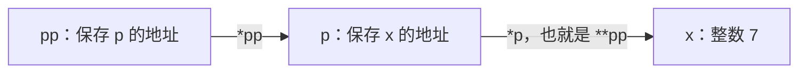
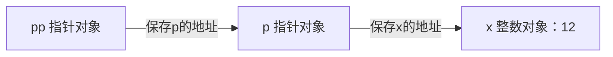

## 指针也是一个对象

### 从对象、地址到解引用

在 C 中，**对象**是一块用于保存值的存储区域；**变量**通常通过名字让我们访问对象。`int x = 7` 创建一个整数对象并初始化为 7。**地址**用于标识对象所在位置；**指针变量**保存指向某个对象或函数的指针值。地址不是对象内容，指针也不是被指向的整数。

**取地址** `&x` 得到指向 x 的指针；**解引用/间接访问** `*p` 用 p 指向的对象作为操作对象。只有当 p 有效指向仍在生命周期内、类型与对齐要求合适的对象时，这样访问才合法。**空指针**表示没有指向可访问对象，不能解引用；“当前没有分配内存”不等于允许先写 `*p` 再补分配。

**一级指针**指向普通对象，如 `int *`；**二级指针**指向一级指针对象，如 `int **`。星号数量反映间接访问层级，不表示它指向的内存块更大。

不要只背“二级指针指向指针”。设 `int x = 7; int *p = &x; int **pp = &p;`：

```text
pp                 p                  x
+------------+     +------------+     +------+
| p 的地址   | --> | x 的地址   | --> |  7   |
+------------+     +------------+     +------+
int **             int *              int
```



| 表达式 | 类型 | 含义 |
| --- | --- | --- |
| `x` | `int` | 整数对象 |
| `&x`、`p` | `int *` | 指向 x 的地址值 |
| `*p` | `int` 左值 | x 本身，可赋值 |
| `&p`、`pp` | `int **` | 指针变量 p 的地址 |
| `*pp` | `int *` 左值 | p 本身，可改变其指向 |
| `**pp` | `int` 左值 | 经两次间接访问到 x |

声明中的 `*` 表示指针类型，表达式中的 `*` 是间接访问。`int *p, q;` 中只有 p 是指针，建议分别声明以免误读。

### 严格区分对象、值、表达式与生命周期

C中的对象是可用于表示值的一块数据存储；对象类型决定如何解释它。指针对象p本身存放一个指针值，它与被指向的整数对象x是两个对象。表达式`*p`在p有效指向x时指称x，并不是复制一个新的x；表达式`&p`取得的是p这个对象的地址。

可修改左值不是“写在等号左边就成立”的语法外观：它必须指称可修改对象。例如本例的x、*p、**pp可赋值；整数常量7不是对象入口，不能赋值。数组名通常转换成首元素指针，但数组对象本身不是可用赋值运算符整体替换的指针变量。

下面只比较指针是否指向预期对象，不打印随运行变化的真实地址。这样可以稳定核对状态，同时避免把示意地址当作机器上的真实地址。

```c
#include <assert.h>
#include <stdio.h>
int main(void) {
    int x = 7;
    int *p = &x;
    int **pp = &p;
    printf("p points to x: %d\n", p == &x);
    printf("pp points to p: %d\n", pp == &p);
    **pp = 12;
    assert(x == 12);
    printf("x=%d, *p=%d, **pp=%d\n", x, *p, **pp);
    return 0;
}
```

<!-- study-run:BEGIN sha256=68f6fae3ffe20f9ef8e216d81535fa7eded18bf7f2747961f8c9cee6466d7ea6 -->
本段代码的实测输出（GCC，C17；不代表所有输入）：

```text
p points to x: 1
pp points to p: 1
x=12, *p=12, **pp=12
```
<!-- study-run:END -->



箭头表示指向关系，不表示对象在内存中左右相邻。对象生命周期结束后，不能继续通过指向它的旧指针读写；将一个别名置NULL也不会同步修改其他别名。本文的“所有权”是程序约定的释放责任，不是C类型系统自动提供的保障。`const`限制某条访问路径上的修改权限，不是生命周期保证。

## 参数永远按值传递

### 慢读：先分清“格子”和“格子里写的值”

把内存暂时想成带名字的格子。x的格子存7，p的格子存“x格子的位置”，pp的格子存“p格子的位置”。这是帮助理解的模型，不表示真实地址必须是普通整数，也不表示相邻变量一定挨着存放。

现在依次执行三种操作，它们改的不是同一个格子：

| 操作 | 真正写入的对象 | 之后的关系 |
| --- | --- | --- |
| `**pp = 9` | x | p仍指向x，x变成9 |
| `*pp = &y` | p | p改为指向另一个仍有效的整数y，x仍为9 |
| `pp = &q` | pp | 以后经pp访问的是q，不再是p |

可以把解引用看成“沿一条箭头到达格子”，但它不是数值函数的逆运算：空指针、已释放对象的地址，都不允许你继续沿箭头读取。每看到一层星号，就问当前指针是否有效、这一步到达的对象是什么类型。

### 慢读：函数为什么能改数据，却改不了外面的指向

设调用者有 `p=&x`，调用一个接收 `int *q` 的函数。进入函数时新建的是q这个局部格子，它复制p里的地址。因此 `q=p` 的直觉只能表达“两个格子值相同”，不能表达“它们是同一个格子”。写 `*q=10` 会走到共同的x；写 `q=NULL` 则只擦掉局部格子q里的地址。

若要修改p，就传 `&p`。此时形参 `int **r` 仍是副本，但副本里保存的是p的位置，故写 `*r` 能改到p。C从来没有例外地改成“引用传递”；变化的是你传入了哪一层对象的地址。

**实参**是调用处提供的表达式，如 `erase_first(&head, 3)` 中的 `&head` 与 3；**形参**是函数定义里接收相应值的局部对象。**值传递**表示形参取得实参值的副本。指针值可以被复制，所以“传了指针”与“复制了所指向的整个链表”不同。

函数接收 `Node *p`，得到的是地址的副本。调用者的 root 和函数内的 p 是两个指针变量，只是起初保存同一地址：

```text
调用者 root ----> 结点 A <---- 函数局部 p
p = NULL       只改局部 p
p->data = 9    通过地址改共同指向的 A
```

### 把“读结点、改结点、改根”完整拆开

先不要记三个函数参数类型。我们先建一个能看见的场景，再根据要改的东西选择类型。

**Node是什么？** 它是我们给一种结构体类型起的名字，不是C语言的内置关键字。一个Node对象把两个字段放在一起：`data`保存整数数据，`next`保存下一个Node的地址。**字段**就是结构体里面的成员。写 `a.data` 表示结点对象a里的data字段；写 `p->data` 表示先通过指针p找到结点，再访问它的data字段。

后面的完整程序用 `typedef struct Node { ... } Node;` 定义这个类型。花括号里面描述每个结点有哪些字段，末尾的Node为这个结构体类型提供简写名称；`struct Node *next`只保存地址，不是在结点内部再完整嵌套一个结点，所以不会无限嵌套。

**root是什么？** 这里只是一个变量名，和head、p一样由程序员选取。我们用它保存进入链表或树的第一个结点地址。链表通常把它叫head，树通常叫root。名称本身没有特殊语法作用。

设我们创建两个结点：a的数据是7，b的数据是20，两者next都为空。再定义 `Node *root = &a`。现在有**三个不同对象**：结点a、结点b、指针变量root。root不是结点a，它只是保存a的地址。

```text
main中的对象：
root这个变量 [ a的地址 ] ─────→ 结点a [ data:7  | next:NULL ]
                               结点b [ data:20 | next:NULL ]
```

“把a的数据改成9”和“让root改为指向b”是两种完全不同的任务。前者改变结点a里的一个字段；后者改变root变量保存的地址，a、b里面的数据都可以保持不变。

#### 第一种：我只想读出a的数据

函数接收 `const Node *p`，调用时传root。函数得到a的地址，就可以读 `p->data`。其中const限制的是**通过p访问到的这个Node**：函数不能写 `p->data = 9`，也不能写 `p->next = ...`；它可以读这些字段。

p这个局部指针本身仍可重新赋值，例如让p为空。这不会改变调用者的root。请把const理解为这一条访问路径的写入限制，不是把整个内存对象永久冻结，更不是把整条链表深度锁定：其他可写指针仍可能修改a；访问next指向的其他结点，也需要单独约束接口。

`Node *`传给`const Node *`参数是允许的：这次调用主动收窄了写权限，不需要把root本身重新声明为const。

#### 第二种：我想把a的数据从7改成9

函数接收 `Node *p`，调用 `set_data(root, 9)`。调用时把root里保存的地址复制给p，因此root和p都指向a。执行 `p->data = 9` 时，先沿p找到a，再修改a里面的字段。函数返回后p这个局部变量不再使用，但a里已经写入的9不会自动撤销。

```text
调用时： main的root [a的地址] ──→ a ←── 函数的p [a的地址]
写入时： p->data = 9                 a.data从7变成9
返回后： root仍保存a的地址           a.data仍为9
```

为什么地址只是副本，却能改到外面的结点？因为**复制地址不等于复制结点**。两张写着同一位置的纸条仍然指向同一个对象。这里不需要二级指针，因为要改的目标就是沿一级指针到达的结点。

#### 第三种：我在函数里写p=b的地址，为什么root没跟着变

假设函数仍收 `Node *p`，在内部执行 `p = new_root`，其中new_root保存b的地址。这句没有星号或箭头去访问别的对象，只是在给局部变量p赋值。

```text
赋值之前：root [a的地址] ──→ a ←── p [a的地址]
赋值之后：root [a的地址] ──→ a
                            b ←── p [b的地址]
```

函数里的p现在能访问b，并不意味着main里的root变了。**调用者**就是执行函数调用的那一方；本例是main。“修改调用者的根变量”准确地说，就是修改main那一个root对象，不是修改被调用函数里另一个碰巧也叫root的局部变量。

即使把形参p也命名为root，结论仍相同：名字相同不代表对象相同。判断时先看变量在哪次函数调用中创建，再看它存的是什么。

#### 第四种：我确实要让main里的root指向b

这次要修改的是root这个指针变量，因此必须知道**root本身的位置**。调用时传 `&root`，不是传root：

- `root`的值是a的地址，类型为`Node *`。
- `&root`的值是root变量的地址，类型为`Node **`。
- 用`Node **pp`接收后，pp保存root的位置；`*pp`便代表main里的root对象。
- 执行 `*pp = new_root`，就是把b的地址写入main里的root。

```text
pp [root的地址] ──→ root [a的地址] ──→ a

执行 *pp = &b 后：
pp [root的地址] ──→ root [b的地址] ──→ b
                                      a仍然存在，只是不再由root指向
```

pp自己仍是局部副本，C并没有改成引用传递。关键在于：这份副本保存的是“待修改变量的位置”。若只写 `pp = NULL`，改掉的仍然只是局部pp，不会把root置空；要把root置空，应写 `*pp = NULL`，并保证pp有效。

#### 把四种情况放进一个可运行程序

下面不使用malloc，先排除分配和释放的干扰。a、b都在main中创建，在这些函数调用期间始终存在，程序不应对它们调用free。各辅助函数约定收到有效指针；这里特意先固定合法输入，再观察“到底改了谁”。

```c
#include <assert.h>
#include <stdio.h>

typedef struct Node {
    int data;
    struct Node *next;
} Node;

void print_node(const Node *p) {
    printf("read data: %d\n", p->data);
}

void set_data(Node *p, int value) {
    p->data = value;
}

void try_change_root(Node *p, Node *new_root) {
    p = new_root;
    printf("local p now reads: %d\n", p->data);
}

void change_root(Node **pp, Node *new_root) {
    *pp = new_root;
}

Node *return_new_root(Node *p, Node *new_root) {
    p = new_root;
    return p;
}

int main(void) {
    Node a = {7, NULL};
    Node b = {20, NULL};
    Node *root = &a;

    print_node(root);
    assert(root == &a && a.data == 7);

    set_data(root, 9);
    assert(root == &a && a.data == 9);

    try_change_root(root, &b);
    assert(root == &a); /* The caller's pointer did not change. */

    change_root(&root, &b);
    assert(root == &b && a.data == 9 && b.data == 20);

    root = &a;
    (void)return_new_root(root, &b); /* Discard the returned address. */
    assert(root == &a);
    root = return_new_root(root, &b); /* Store it in the caller's root. */
    assert(root == &b);
    puts("pointer layers tests passed");
    return 0;
}
```

<!-- study-run:BEGIN sha256=7d91ebc5eaef94ca1b0b64e4b481c6ba2d4bc4e827ba4bf781db53606c72f1cf -->
本段代码的实测输出（GCC，C17；不代表所有输入）：

```text
read data: 7
local p now reads: 20
pointer layers tests passed
```
<!-- study-run:END -->

运行时依次显示 `read data: 7`、`local p now reads: 20`、`pointer layers tests passed`。第二行特意展示“函数内已经指向b，但外面的root仍指向a”的时刻；随后的断言验证它，而不是靠打印猜测。assert是运行时检查条件的宏，条件不成立会终止程序；示例测试不要关闭断言。

`Node a = {7, NULL}`按字段声明顺序初始化：data为7、next为空。`&a`取得a的位置；`root == &a`比较root保存的地址是不是a的位置，不比较两结点的数据。区分这里的赋值`=`与比较`==`也很重要。

#### “返回新根”到底是谁完成赋值

上述 `return_new_root` 是为了单独观察返回值的教学函数，不是插入算法。它把b的地址返回出去，但只有调用者执行 `root = ...` 才会把这个地址存入外面的root。忽略返回值时，这个教学函数只修改自己的局部变量，所以root不变。

原句里的 `root = insert(root, value)` 可以从右到左分两步读：先让insert根据旧根和值完成插入，并算出结果树的入口地址；再由调用者把这个地址写进root。函数返回类型应为 `Node *`。另一种接口则由insert接收 `Node **`，通过`*参数`直接修改root；两种都是合法设计，不必同时使用。

注意，真正的insert即使返回值被忽略，也**可能已经修改了原结点的孩子字段**；不能把“调用者的root未重新赋值”误说成“整棵树完全没变”。空树创建首结点、头插、树旋转等可能改变入口的操作，尤其需要接住新根，否则可能丢失新结构的入口甚至泄漏内存。

现在再看原来的概括，它应当成为上面例子的总结，而不是理解例子的前提：

只读结点可用 `const Node *`；修改结点字段用 `Node *`；修改调用者的根变量用 `Node **`。另一种写法是返回新根，再由调用者执行 `root = insert(root, value)`。

这是按需求选择最直接接口的经验总结，并非语法强制的唯一方案；关键是区分被修改的对象。一级指针足以修改结点自己的next字段，因为它属于结点；只有要改调用者那一个指针变量时，才需要它的地址或由调用者接收返回值。

**停下来检查是否真的分清：** `p->next = &b`改的是p指向结点的next字段；`p = &b`改的是局部p；`*pp = &b`在pp指向main的root时改的是root。这三句都可能“改变某种指向”，但写入的位置不同，所需的参数就不同。

“传地址实现引用效果”不是说 C 有引用传递。二级指针形参自己仍是副本，但 `*形参` 可以访问调用者的那个一级指针对象。

## 完整程序：指向链接的指针

示例是不带哨兵头结点的单链表。`Node **link` 指向“存放当前结点地址的槽”：它可能是外面的 head，也可能是前一个结点的 next。

输入是头指针的地址与待操作整数，插入/删除返回是否成功，清理会把调用者头指针置空。main 从空表头插 1、2、3 得到 `3→2→1`，再删 3 和 1 得到单结点 2。请先在纸上跟踪 `link` 究竟指向 head 还是某个 next，再阅读循环代码。

```c
#include <assert.h>
#include <stdbool.h>
#include <stdio.h>
#include <stdlib.h>

typedef struct Node {
    int data;
    struct Node *next;
} Node;

bool push_front(Node **head, int value) {
    if (head == NULL) return false;
    Node *node = malloc(sizeof *node);
    if (node == NULL) return false;
    node->data = value;
    node->next = *head;
    *head = node;
    return true;
}

bool erase_first(Node **head, int value) {
    if (head == NULL) return false;
    Node **link = head;
    while (*link != NULL && (*link)->data != value)
        link = &(*link)->next;
    if (*link == NULL) return false;
    Node *dead = *link;
    *link = dead->next;
    free(dead);
    return true;
}

void clear_list(Node **head) {
    if (head == NULL) return;
    while (*head != NULL) {
        Node *dead = *head;
        *head = dead->next;
        free(dead);
    }
}

int main(void) {
    Node *head = NULL;
    for (int i = 1; i <= 3; ++i) {
        if (!push_front(&head, i)) {
            clear_list(&head);
            return EXIT_FAILURE;
        }
    }
    assert(head->data == 3);
    assert(erase_first(&head, 3));
    assert(erase_first(&head, 1));
    assert(!erase_first(&head, 9));
    assert(head->data == 2 && head->next == NULL);
    clear_list(&head);
    assert(head == NULL);
    clear_list(&head);
    puts("pointer tests passed");
    return 0;
}
```

<!-- study-run:BEGIN sha256=03a86a420b44364a922451635d58afa8055cab92ff5cf90b18d5222a4c7bfe57 -->
本段代码的实测输出（GCC，C17；不代表所有输入）：

```text
pointer tests passed
```
<!-- study-run:END -->

### 核心循环的不变量

先跟踪 `3→2→1` 删除2，设三个实际结点叫A、B、C，数据分别为3、2、1：

| 时刻 | link指向的槽 | `*link`的值 | 已知事实 |
| --- | --- | --- | --- |
| 初始化 | 调用者head | A的地址 | 候选为首结点 |
| 检查3不等于2后 | A.next | B的地址 | A不是目标，不能丢失A |
| 找到2 | 仍为A.next | 仍为B的地址 | dead保存B的地址 |
| 重接后 | 仍为A.next | C的地址 | A现在直接连到C |
| 释放后 | 仍为A.next | C的地址 | B已不存在，不能再读取dead的字段 |

`&(*link)->next`从内向外读：`*link`取得候选结点地址，`->next`定位它的next字段，最外面的`&`取得这个字段本身的地址。不是对next保存的地址“再往后加一”。箭头表达式 `p->next` 等价于 `(*p).next`，只是成员访问的简写。

删除首结点时，link恰好指向head，完全相同的赋值会修改head；这就是统一写法的价值。你无需先背“二级指针高级技巧”，只需确认被改写的都是同类型的指针槽。

`link = &(*link)->next` 不是“link 变成下一个结点”，而是“link 指向当前结点的 next 字段”。始终有：`*link` 是当前候选结点，link 是连接它的那个指针槽。

删除时无需判断是不是首结点，因为 head 和 `prev->next` 都能由 `*link = dead->next` 修改。这与哨兵头结点一样能减少边界分支，但机制不同。

头插 $O(1)$；查找并删第一个匹配最坏 $O(n)$；全部释放 $O(n)$；三者辅助空间均 $O(1)$。

### 为什么先重接再释放

释放后再读 `dead->next` 是释放后使用。`free` 不会自动清空所有别名；本例将拥有链表的 head 更新到 NULL，但外部若保留某个已释放结点地址，它仍然悬空。

分配失败时 `push_front` 保持旧结构不变，因为直到新结点初始化完成才修改根。若一开始就覆盖 head，后续失败可能丢失旧链表。

## 二级指针在树里的同一含义

插入二叉搜索树时，要修改的可能是 root，也可能是某结点的 left/right。三者都是保存结点地址的指针槽。可从 `Node **slot = &root` 开始，按大小关系走向 `&(*slot)->left` 或 `&(*slot)->right`，到空槽才分配。

二级指针不是树的专用技巧；函数返回新分配数组、解析器输出结果时也常用。关键问题始终是：你想改的是对象，还是保存对象地址的那个变量？

## 数组与二级指针不能混淆

`int a[3][4]` 在多数表达式中转换为 `int (*)[4]`，即指向一行的指针，不是 `int **`。连续二维数组加一跨过 4 个整数；二级指针通常先访问一个行指针表，两者内存布局不同。

把二维数组强转为 `int **` 不会生成行指针。图的邻接矩阵应显式声明行宽，或使用一维数组 `a[i * n + j]`。

局部数组的 `sizeof a` 是整个数组字节数；函数形参 `int a[]` 调整为指针后，`sizeof a` 不能求元素个数，应额外传长度。

`malloc(n * sizeof *p)` 还要防乘法溢出，通用接口检查 `n <= SIZE_MAX / sizeof *p`。本例只分配单结点。标准 C 中无需强转 `malloc` 返回值；检查 NULL 比强转重要。

## const 和所有权是两件事

**作用域**回答名字在代码的哪些位置可见；**生命周期**回答对象在运行时何时存在。局部名字离开作用域与动态对象被释放不是同一回事。`malloc` 得到的对象可以在创建它的函数返回后继续存在，直至释放；返回函数局部自动变量的地址则会留下悬空指针。

**动态分配**是在运行时请求存储；**所有权**是程序设计约定：谁负责在不再需要时释放；**借用**允许暂时访问但不转移释放责任；**别名**指多个指针指向同一对象。这些不是 C 自动帮你维护的规则，需要靠接口和调用者遵守。

- `const Node *p`：不能通过 p 修改结点，p 自己可改指向。
- `Node *const p`：p 不能改指向，但结点可改。
- `const Node *const p`：两者均受限。

`const` 不保证对象不会被别处释放，也不负责回收内存。`T **` 不能随意转成 `const T **`，多级间接访问会让写入破坏类型约束。

本例约定链表拥有动态结点，外部只借用地址。若两个表共享尾链，分别清理会重复释放；若在栈上创建 Node 后又交给 clear_list，也会非法释放。算法正确性必须建立在所有权前提上。

## 高频错误清单

未初始化指针解引用；空指针解引用；返回局部变量地址；释放后使用；重复释放；只把局部指针置空却误以为调用者已清空；漏查分配失败；把二维数组当二级指针；修改头指针时忘记传其地址。

递归释放树还隐含“无环、无共享孩子”条件。把它直接用于图，会导致无限递归或重复释放。

## 自编练习与解析

**1. 已有哨兵头结点，向其后插入，为何一级指针足够？** 修改的是 `head->next` 字段，不是调用者的 head。若连哨兵都要创建或销毁并更新调用者的根，就需要二级指针或返回值。

**2. 交换两个一级指针形参，为何调用者不变？** 只交换了副本。若交换两个根，接收两个二级指针并交换 `*a`、`*b`；若交换结点中的 data，一级指针已足够。

**3. 如何删掉所有匹配元素而不漏掉连续相等结点？** 删除后不要推进 link，因为 `*link` 已是下一个候选；仅在不删除时推进。一次扫描 $O(n)$，不需要每删一次都重新从头查找。

**4. 构建函数返回 NULL，是空树还是失败？** 两种情况混在一起会丢信息。设计布尔或枚举状态，再用 `Node **out` 返回结构；失败时要明确是否回滚。

## 面试口述模板

“C 的参数按值传递。传一级指针能通过地址访问对象；要改变调用者的指针变量，就传这个变量的地址，也就是二级指针。它指向的是一条可修改的链接，而不只是增加了一个星号。接口仍须约定有效性、生命周期、所有权与失败行为。”
