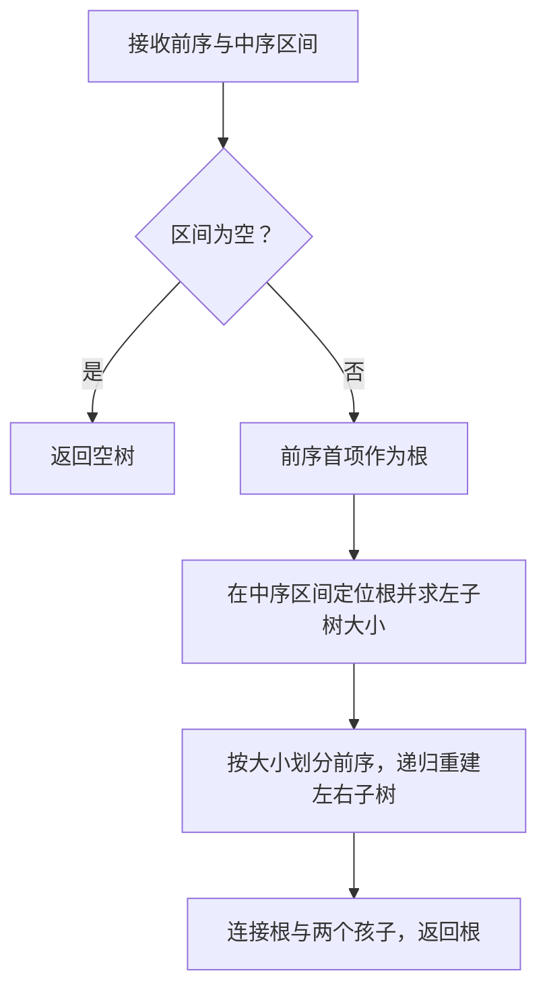

## 从遍历反推结构，需要哪些信息

**遍历序列**是按某种访问顺序记录的结点标识列表；**重建**是根据序列恢复结点间左右孩子关系，不只是把字符重新排序。所谓**唯一**，指在给定约束下只存在一种带标识的结构。**关键字互异**让一个标识只对应一个结点；若两个结点都写 A，仅凭 A 无法区分它们。

前序 AB 与后序 BA 的两种结构，是学习“信息不足”的最小反例：序列能说明 A 在 B 前被进入、在 B 后被完成，却不能告诉你 B 占左槽还是右槽。

关键字互异、序列合法且来自同一棵树时，前序+中序或后序+中序可以唯一重建。中序给出左右子树的边界，前序第一个或后序最后一个给出根。所谓“任意两种遍历都行”是错误的。

前序 AB、后序 BA，既可能 A 的左孩子是 B，也可能右孩子是 B。即使没有重复关键字也有歧义。增加“每个非叶结点恰有两个孩子”等条件后结论可能改变；必须按题目约束讨论。

只有单个遍历序列一般不足，但**带空指针标记的前序**能够唯一确定一般二叉树，例如 `AB##C##`。因为每个结点的两个槽位都被显式描述。字符 # 在此不能再当普通数据。

## 手推前序与中序重建



前序 `ABDECF`，中序 `DBEACF`：

1. 前序首项 A 为根，在中序中把 `DBE` 与 `CF` 分为左右子树。
2. 左子树有 3 个结点，所以前序 A 后的 `BDE` 属于左子树，不是猜到 C 才停止。
3. 在 `BDE / DBE` 中，B 为根，D 为左子树、E 为右子树。
4. 右边 `CF / CF` 中，C 为根，左空、右为 F。

若前序区间起点为 p，中序左闭右开区间为 `[l,r)`，根在中序位置 k，那么左子树规模为 `k-l`，右子树前序起点为 `p+1+(k-l)`。区间最好只采用一种端点约定，避免混用导致少一项。

顺序扫描中序找根会产生最坏 $O(n^2)$；建立关键字到中序下标的映射后，查找可做到 $O(1)$，总时间 $O(n)$。关键字重复时映射不再唯一，不能直接套这个论证。

## 线索化到底节省了什么

### 慢读：把序列当成带边界的子问题

重建时最容易把“中序位置”和“前序位置”混为同一个下标。它们是两份排列中的位置，并不逐项对应。前序告诉你子问题的根是谁，中序告诉你根两侧各有哪些结点；只有**规模**可以跨序列传递。

仍用前序ABDECF、中序DBEACF，以0起始、右端不含的区间表示：

| 当前子问题 | 前序起点p | 中序区间 | 根的中序位置k | 左子树规模 |
| --- | --- | --- | --- | --- |
| 整棵树 | 0 | [0,6) | A在3 | 3 |
| A的左子树 | 1 | [0,3) | B在1 | 1 |
| B的左子树 | 2 | [0,1) | D在0 | 0 |
| B的右子树 | 3 | [2,3) | E在2 | 0 |
| A的右子树 | 4 | [4,6) | C在4 | 0 |

例如A的右子树起点是 $0+1+3=4$：越过根，再越过左子树的3项。这不是“两个数组碰巧下标相同”的性质。写程序前先填写这张表，再检查每次递归的区间是否严格缩小。

### 慢读：线索是一种附加解释，不是新孩子

样例中序为D、B、E、A、C、F。E没有真实右孩子，所以其右指针可以保存后继A；此时必须把rtag设为1。若只看指针非空并递归，就从E回到A，再走回E，形成重复访问。线索标志相当于给同一存储字段附上“解释方式”：存孩子地址，还是存顺序邻居地址。

这里节省的是遍历期间的额外栈需求，不是凭空消除了信息。原本由调用栈记住的部分顺序关系，被预先写进空指针槽和标志位。动态插删会破坏这些关系，因此本讲先限定“一次构建、一次线索化、随后只读遍历”。

**前驱/后继**总是相对于指定顺序而言：在中序序列中某结点前一个/后一个结点，叫它的中序前驱/后继，不一定是父亲或孩子。**线索**是用原本空的孩子指针保存这种顺序关系；**线索化**是建立这些链接的过程；**标志位**用来辨认指针表示孩子还是线索。普通树的拓扑关系并没有因此增加真实树边。

n 个结点有 2n 个孩子指针槽，实际树边占 n-1 个，空槽共有 n+1 个。线索二叉树把部分空槽用于保存某种遍历下的前驱或后继，避免每次从根重新找。

中序线索树约定：`ltag==0` 表示 left 为孩子，`ltag==1` 表示 left 为中序前驱；rtag 对称。**指针非空不再意味着它是孩子。** 沿线索递归会回到祖先或相邻结点，可能形成死循环。

中序后继规则：若右指针是线索，直接走它；若右边是真实子树，则取右子树中最左侧结点。无头结点版本中，最前结点前驱和最后结点后继可为 NULL；有头结点版本是另一套约定，不能混用。

## 完整 C 程序：重建后再线索化

### 代码里的pre、in不是“整棵树对象”

它们是指向字符的指针，分别标出当前前序、中序片段的起点；n说明当前片段有几个字符。一个片段由“起点+长度”共同定义，不能只看指针后面还有多少字符。递归时原字符串不被切开，也没有重新复制数组。

`pre + 1`表示跳过一个字符，移动到下一个字符的位置，不是把字符A的编码加1变成B。`in + k + 1`则跳过左子树的k个字符和根。指针加法以所指元素为步长；这里元素类型为char，所以每次跨一个字符。

在当前片段中，k从0重新计数。整棵树前序ABDECF、中序DBEACF时，根A在当前中序的k=3位置：

| 子问题 | 前序起点 | 中序起点 | 长度 | 实际处理的两段 |
| --- | --- | --- | --- | --- |
| 左子树 | pre+1 | in | k=3 | BDE与DBE |
| 右子树 | pre+1+k | in+k+1 | n-k-1=2 | CF与CF |

前面的数学推导用了全局下标区间，程序用了移动起点加局部长度；两种表示表达同一划分，不能把全局位置直接当本函数的k。程序先确认k<n，之后才做n-k-1，避免无符号长度发生下溢。

### 为什么除了返回根，还要一个ok

`build_part`返回NULL可能表示“长度为0的合法空树”，也可能表示“分配失败”或“序列矛盾”。仅一个指针值无法区分这些情况，因此另用bool状态。`bool *ok`保存外面那个状态变量的地址；写`*ok=false`能让所有递归调用共享失败信息。它与第一讲修改调用者变量的原理相同，这次被修改的对象类型是bool而不是Node指针。

`Node **out`则保存外面根变量的地址。外层rebuild返回true/false告诉你成功与否，通过`*out`交付树。失败时已分配的部分树会销毁，不能把“建了一半”当作合法结果。这里要求调用前`*out`为空，是为了避免覆盖调用者已有树、让旧树失去入口。

### previous为什么不是“当前结点的父亲”

在中序线索化中，previous的含义是**全局中序访问刚刚完成的那个结点**。它要跨递归层保持更新，因此make_threads先创建一个局部指针previous，再把它的地址传给thread_visit。函数的`Node **previous`形参指向这个共享的指针变量。

对中序D、B、E、A、C、F，处理E时，`*previous`为B，虽然E的父亲恰好也是B；处理A时，`*previous`则为E，E显然不是A的父亲。因此不能用某一次碰巧重合来理解整个变量。

处理E的步骤是：先确认其左子树已完成；若E左槽为空，就把B的地址作为前驱线索放进去并标记；若B右槽为空，就把E作为B的后继线索（样例B有真实右孩子E，所以不覆盖）；最后更新共享previous为E。处理A时发现E没有真实右孩子，才把E.right写成A并设rtag。标志与指针必须成对理解。

### first和next怎样不依赖递归继续走

first沿真实左孩子一直走，找到当前子树中序第一个结点；看到ltag表示线索就不能再当左孩子下钻。next先看rtag：是线索，right就是直接后继；不是线索，right是一棵真实右子树，要找它的first。`条件 ? 值1 : 值2`是C的条件运算符，选一个分支求值，不是把两条路线都走一遍。

因此循环里的`p=next(p)`不是普通的“走右孩子”，而是按两种指针含义选择正确的后继。线索化后仍使用普通树的递归遍历，是改变了数据解释却没改变读取方式。

输入采用互异的非零单字节字符。下面先检查两序列字符集合，再递归检查每个根是否位于应属的区间。线索化只允许对新建普通树执行一次；不实现动态插删维护。

输出根通过 `Node **out` 写回，布尔返回值区分合法空树与失败。`previous` 在线索化中记录刚刚按中序访问的结点；它不是递归树上的父亲。最后用 first/next 扫描得到中序字符串，再用只跟随真实孩子的 destroy 释放。字符表示例限定 `CHAR_BIT==8`，不把 256 项表当作任意字节宽度机器的可移植结论。

```c
#include <assert.h>
#include <stdbool.h>
#include <stdio.h>
#include <stdlib.h>
#include <string.h>
#include <limits.h>

_Static_assert(CHAR_BIT == 8, "This character example requires 8-bit bytes");

typedef struct Node {
    char data;
    struct Node *left, *right;
    bool ltag, rtag;
} Node;

void destroy(Node *t) {
    if (t == NULL) return;
    if (!t->ltag) destroy(t->left);
    if (!t->rtag) destroy(t->right);
    free(t);
}

Node *build_part(const char *pre, const char *in, size_t n, bool *ok) {
    if (n == 0 || !*ok) return NULL;
    size_t k = 0;
    while (k < n && in[k] != pre[0]) ++k;
    if (k == n) { *ok = false; return NULL; }
    Node *t = malloc(sizeof *t);
    if (t == NULL) { *ok = false; return NULL; }
    *t = (Node){pre[0], NULL, NULL, false, false};
    t->left = build_part(pre + 1, in, k, ok);
    if (*ok) t->right = build_part(pre + 1 + k, in + k + 1, n-k-1, ok);
    if (!*ok) { destroy(t); return NULL; }
    return t;
}

/* out 必须指向空根槽；失败时仍为 NULL，不覆盖已有树。 */
bool rebuild(const char *pre, const char *in, Node **out) {
    if (pre == NULL || in == NULL || out == NULL || *out != NULL) return false;
    size_t n = strlen(pre);
    if (strlen(in) != n) return false;
    bool a[256] = {false}, b[256] = {false};
    for (size_t i = 0; i < n; ++i) {
        unsigned char x = (unsigned char)pre[i], y = (unsigned char)in[i];
        if (a[x] || b[y]) return false;
        a[x] = b[y] = true;
    }
    for (size_t i = 0; i < 256; ++i) if (a[i] != b[i]) return false;
    bool ok = true;
    *out = build_part(pre, in, n, &ok);
    return ok;
}

void thread_visit(Node *t, Node **previous) {
    if (t == NULL) return;
    thread_visit(t->left, previous);
    if (t->left == NULL) { t->ltag = true; t->left = *previous; }
    if (*previous != NULL && (*previous)->right == NULL) {
        (*previous)->rtag = true;
        (*previous)->right = t;
    }
    *previous = t;
    thread_visit(t->right, previous);
}

void make_threads(Node *root) {
    Node *previous = NULL;
    thread_visit(root, &previous);
    if (previous != NULL) { previous->rtag = true; previous->right = NULL; }
}

const Node *first(const Node *p) {
    while (p != NULL && !p->ltag && p->left != NULL) p = p->left;
    return p;
}

const Node *next(const Node *p) {
    if (p == NULL) return NULL;
    return p->rtag ? p->right : first(p->right);
}

int main(void) {
    Node *root = NULL;
    if (!rebuild("ABDECF", "DBEACF", &root)) return EXIT_FAILURE;
    make_threads(root);
    char out[7]; size_t n = 0;
    for (const Node *p = first(root); p != NULL; p = next(p)) out[n++] = p->data;
    out[n] = '\0';
    assert(strcmp(out, "DBEACF") == 0);
    destroy(root); root = NULL;
    assert(!rebuild("AA", "AA", &root));
    assert(!rebuild("ABC", "CAB", &root));
    assert(root == NULL);
    assert(rebuild("", "", &root) && root == NULL);
    puts("reconstruction and threading tests passed");
    return 0;
}
```

线索化时间 $O(n)$、递归栈 $O(h)$；线索化完成后的整个中序扫描为 $O(n)$、辅助空间 $O(1)$。单次 next 不一定 $O(1)$，它可能沿右子树的左链走 $O(h)$；但完整扫描每条相关孩子边只走有限次，不能误报总时间 $O(nh)$。

程序的重建采用扫描找根，最坏 $O(n^2)$。字符集大小固定为 256，也明确了它不是任意 Unicode 字符解析器。

## 树、森林与二叉树：左孩子右兄弟

一般树每个结点孩子数不固定，可以用 firstChild 和 nextSibling 两个指针表示。解释为二叉树时：左边指向第一个孩子，右边指向下一个兄弟。**右边不再表示一般树意义的孩子。**

```text
一般树：A 的孩子依次为 B、C、D；B 的孩子为 E、F。

孩子兄弟表示：
       A
      /
     B --right--> C --right--> D
    /
   E --right--> F
```

单棵一般树转换后的根没有右孩子；森林把各棵树根按顺序串成右链。转换保留结点数量与有序关系，但通常不保留高度、度和叶子数。一般树的叶子只要求 firstChild 为空，即转换后二叉树的 left 为空，不要求 right 也空。

树的先根遍历对应转换二叉树的前序；树的后根遍历对应转换二叉树的中序。森林常见定义下，先序也对应二叉树前序、后序对应二叉树中序。不要看到“森林后序”就直接选二叉树后序。

推导后根关系：依次访问 A 的每个孩子及其子孙，最后访问 A；二叉树中序会先处理 A 的左子树，其中 right 链负责依次处理兄弟，最后访问 A，恰好相同。一般树层序则不能直接用转换后二叉树的普通层序替代。

## 哈夫曼树：最小化的是带权路径长度

**权值**是叶子的重要程度或出现频数等非负数；**带权路径长度**把每个叶子深度乘以其权值后求和；**哈夫曼树**是在给定叶子权值下达到最小带权路径长度的二叉树。这里的叶子代表原始符号，合并生成的内部结点代表一组符号，不是新增字符。

**编码**把符号映射为位串；**前缀**是一个位串从开头截取的部分；**前缀码**要求任一符号编码不是其他符号编码的前缀。例如 0、10、11 可以逐位解码，0、01 则不满足这个条件。**贪心**指每步按当前局部准则选择；它需要正确性证明，并不是“每次选最小就总正确”。

给定非负权值 $w_i$，叶子深度按根到叶子的边数 $d_i$ 计：

$$
\mathrm{WPL}=\sum_i w_i d_i.
$$

贪心算法反复合并当前两个最小权值，生成权值为两者之和的新结点，直至只剩根。较小权值应该承担较大的深度；在最优树中可通过交换安排两个最小权叶子成为最深的一对兄弟。把这对兄弟收缩为一个叶子，问题变成同类子问题，这给出交换论证与最优子结构。

每次合并使这两棵子树中的所有叶子深度加一，因此增加的 WPL 正好是两棵子树权值和。**总合并代价等于最终 WPL**，求 WPL 不必显式画树。

权值 2、3、7、9：合并 2+3=5，再 5+7=12，最后 9+12=21，WPL 为 5+12+21=38。相同权值造成多种形态或编码，但最优 WPL 相同。单一字符的数学树深度为 0；实际编码格式可能约定至少一位，属于额外协议。

## 完整 C 程序：用合并模拟计算 WPL

### 从求和交换看“合并代价等于WPL”

一个原始叶子每经历一次祖先合并，深度就增加1，其权值就被计入一次合并费用。先按合并步骤求和，等于先按叶子求和：叶子i一共被计入 $d_i$ 次，因此贡献 $w_i d_i$。这是一种有限求和换序，不依赖合并是否最优；**任意**二叉合并树的总合并费用都等于其WPL，哈夫曼的贪心负责让这个值最小。

权值2、3、7、9中，2和3被计入3次，7被计入2次，9被计入1次，故 $2\times3+3\times3+7\times2+9=38$。它与5+12+21一致。请注意，内部结点权值不是又一组额外叶子，不能把内部结点的深度加权再算一次。

为突出贪心，以下用线性扫描选最小值，总时间 $O(n^2)$；若用小根堆，则建堆 $O(n)$、n-1 次合并共 $O(n\log n)$。代码限制最多 64 个权值，并检查加法溢出。

```c
#include <assert.h>
#include <limits.h>
#include <stdbool.h>
#include <stddef.h>
#include <stdio.h>

bool huffman_wpl(const unsigned long long *weights, size_t n,
                 unsigned long long *answer) {
    if (answer == NULL || n == 0 || n > 64 || weights == NULL) return false;
    unsigned long long pool[127], total = 0;
    bool used[127] = {false};
    for (size_t i = 0; i < n; ++i) pool[i] = weights[i];
    for (size_t size = n; size < 2*n-1; ++size) {
        size_t a = size, b = size;
        for (size_t i = 0; i < size; ++i)
            if (!used[i] && (a == size || pool[i] < pool[a])) a = i;
        used[a] = true;
        for (size_t i = 0; i < size; ++i)
            if (!used[i] && (b == size || pool[i] < pool[b])) b = i;
        used[b] = true;
        if (ULLONG_MAX - pool[a] < pool[b]) return false;
        pool[size] = pool[a] + pool[b];
        if (ULLONG_MAX - total < pool[size]) return false;
        total += pool[size];
    }
    *answer = total;
    return true;
}

int main(void) {
    unsigned long long weights[] = {2, 3, 7, 9}, answer = 0;
    assert(huffman_wpl(weights, 4, &answer) && answer == 38);
    assert(huffman_wpl(weights, 1, &answer) && answer == 0);
    assert(!huffman_wpl(weights, 0, &answer));
    unsigned long long huge[] = {ULLONG_MAX, 1};
    assert(!huffman_wpl(huge, 2, &answer));
    puts("Huffman tests passed");
    return 0;
}
```

哈夫曼编码将每个字符放在叶子，左/右分支标 0/1，因此任一叶子编码不是另一叶子的前缀，可无歧义逐位解码。“前缀码”不等于“等长码”，也不等于任意贪心分配更短编码。

## 自编练习与易错辨析

**1. 重建树只检查字符集合相同够吗？** 不够。前序 ABC、中序 CAB 集合相同，但 A 的左子树按中序只能包含 C，而前序下一项是 B，矛盾；程序会在递归区间检查时拒绝。

**2. 线索树释放时为什么看 tag？** 线索不是拥有子树的孩子链接。沿线索释放可能多次到达同一结点。释放只能递归真实孩子，且不能在线索化后仍使用普通无标签遍历。

**3. n 个叶子的哈夫曼树总共几个结点？** 合并 n-1 次，新增 n-1 个内部结点，总数 2n-1；不存在度为 1 的结点。n=1 仍适用。

**4. 哈夫曼树一定高度最小吗？** 不一定。它优化带权路径长度，不优化高度，也不要求平衡或完全。

**5. 树转换成二叉树后高度为何变化？** 同层兄弟变成 right 链，原来同层的结点在二叉树层次里被拉开。转换保存的是孩子/兄弟关系的编码，不是几何外观。
