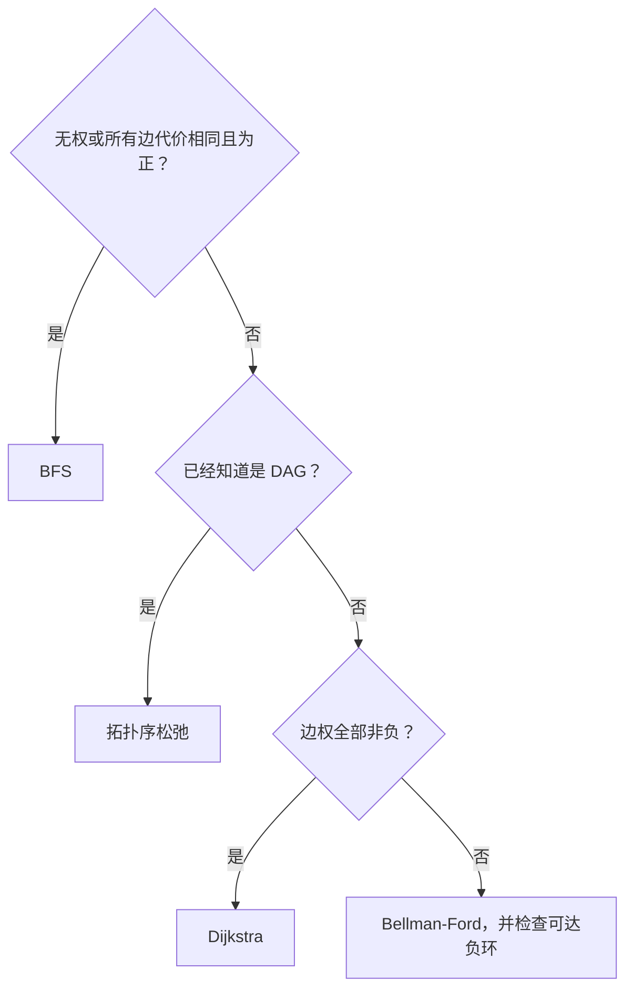

## 先分类，后写算法

**源点**是路径开始的顶点，**目标点/汇点**在路径问题中是所求终点（在网络结构中“汇点”也常专指无出边点）。路径的**权值**为边权之和，**最短路径**是在允许路径中权值最小者。**单源**问题固定一个源求到各点的距离；**所有点对**问题对每个有序顶点对求距离。

**松弛**是尝试用一条新发现的路径降低当前距离估计；**负权边**是权小于零的边；**负环**是总权为负的环。沿可达负环反复绕行可持续降低总权，因此某些目标没有有限最短距离。这里讨论通常允许重复顶点的最短路定义，不把“禁止重复”的最短简单路径问题混入。

**DAG** 即有向无环图。**依赖** u→v 表示 u 必须在 v 前完成，**拓扑序**是一种满足全部这种先后约束的顶点线性排列。它不是最短路，也不是按顶点数值排序；DAG 才能让动态规划按一个不回头的依赖顺序进行。

| 问题条件 | 常见选择 | 核心约束 |
| --- | --- | --- |
| 无权单源 | BFS | 路径代价是边数 |
| 非负权单源 | Dijkstra | 负权会破坏贪心定点 |
| 有负权单源 | Bellman-Ford | 可检测源点可达负环 |
| 多源/所有点对 | Floyd-Warshall | 负环使有关点对无有限最短路 |
| DAG 单源 | 拓扑序松弛 | 可有负边，但不能有环 |



选择算法不是看题目出现“最短路”就写 Dijkstra。首先问图是否有向、边权符号、是否需要所有点对、规模和存储方式。

## 松弛是一个上界更新过程

`dist[v]` 保存已发现的从 s 到 v 的路径长度，最初 s 为 0，其余 INF。边 u→v 权为 w，若 u 可达且 `dist[u]+w < dist[v]`，就得到一个更好的上界。`prev[v]=u` 可用于最后重建路径。

INF 不是实际路径长度。先判断可达再做加法，还必须考虑整数溢出；使用很大的整数不意味着任意相加都安全。不可达目标不能沿 prev 一直走，初值应明确是 -1。

## Dijkstra 为什么不能有负边

每步从未确定顶点中选择 dist 最小的 u，永久确定它。非负边保证任何从尚未确定区域绕行再进入 u 的路径，不可能把 u 的距离变得更小。

反例：s→a 为 2，s→b 为 5，b→a 为 -10。算法可能先把 a 的 2 确定，但真实最短路是 -5。不是“只要没有负环就能用 Dijkstra”，负边本身已可能破坏证明。

矩阵选最小顶点为 $O(V^2)$。邻接表加堆可达 $O((V+E)\log V)$；若用允许重复入堆的懒删除版本，要在出堆时跳过过期距离，堆中项数可能与 E 同阶。

## Bellman-Ford 与负环的范围

没有可达负环时，总能选一条不重复顶点的最短路，最多 V-1 条边。对所有边做 V-1 轮松弛已足够；若某轮没有变化可提前停止。额外一轮仍能改善，说明存在源点可达负环。

只有“源点可达负环且从该负环又能到达目标”时，那个目标才没有有限最短距离。图中别处有不可达负环，不影响该源点的结果；可达负环也不意味着每个顶点都受影响。

原地松弛一轮可能传播多条边，不应把它精确解释为“这一轮只允许多一条边”；正确说法是完成 k 轮后，至多 k 条边的最短路径已获得足够机会。若使用上一轮数组的副本，才能严格逐层限制边数。复杂度 $O(VE)$，辅助空间通常 $O(V)$。

## Floyd 的循环顺序来自状态定义

定义 $D^{(k)}[i,j]$ 为只允许编号前 k 个顶点作中间点的最短距离。是否经过新允许的 k，得到：

$$
D^{(k)}[i,j]=\min\{D^{(k-1)}[i,j],D^{(k-1)}[i,k]+D^{(k-1)}[k,j]\}.
$$

因此 k 必须在最外层。初始化对角线 0、边为权、无边 INF；平行边取最小权。时间 $O(V^3)$、空间 $O(V^2)$。若结束后 `dist[k][k]<0`，存在负环；能到达 k 且 k 能到达的点对受其影响，不能把输出矩阵值当作这些点对的有限最短距离。

## 拓扑排序不是按编号排序

AOV 网络用顶点表示活动、弧表示先后依赖。拓扑序要求每条 u→v 中 u 出现在 v 前面。只有 DAG 才存在拓扑序；有多个可选零入度顶点时序列可能不唯一。

Kahn 算法先把全部零入度点入队，取出一个顶点后删除其出边，邻居入度降至零时入队。处理计数少于 V 就有环。邻接表 $O(V+E)$；矩阵实现 $O(V^2)$。

队列中同时出现两个可选择顶点，说明至少有两种不同拓扑顺序；若每一步只有一个可选点且最终处理完全部顶点，则拓扑序唯一。不要用“原图只有一个源点”代替这个逐步条件。

## 关键路径：名字像最短路，求的却是最长约束链

这里区分**活动**（消耗时间的工作）和**事件**（标记某个时刻条件已满足，本身不消耗工期）。AOV 是活动在顶点上；AOE 是活动在边上，顶点是事件。**工期**为所有必要活动完成所需时间。**时差**是在既定完工时间不被推迟时，活动可推迟开始的余量。**关键活动**的时差为零；首尾衔接形成的最长依赖链是关键路径，可能不止一条。

AOE 网络用边表示活动及其持续时间、顶点表示事件。假设 DAG、活动工期非负、不考虑资源互斥。一个事件只有全部前置活动完成才能发生：

$$
ve[v]=\max_{u\to v}(ve[u]+w(u,v)).
$$

工程最短完工时间是最长依赖路径长度。固定完工时间 T 后，逆拓扑序计算不延误工程的最迟事件时间：

$$
vl[u]=\min_{u\to v}(vl[v]-w(u,v)).
$$

对于活动 u→v，最早开始 e=ve[u]，最迟开始 l=vl[v]-w，时差 l-e=0 就是关键活动。注意 ve、vl 属于顶点事件，e、l 属于边活动。

多源多汇时，可加零权虚拟源/汇。本讲等价地令所有源 ve=0，T 为所有汇最早时间的最大值，所有 vl 初值 T，再逆序传播，表示“所有分支必须在共同 T 前完成”。

## 完整 C 程序：一个网络，两种不同问题

下例为至多 16 个顶点的有向图，边权限定在 0 到一百万，拒绝自环和重复边。它提供 Dijkstra、Floyd 和关键路径计算；后两者的一般理论范围更广，但示例输入接口有意收窄，保证算术边界清楚。

Dijkstra 的输出 d 是源点距离、prev 是路径前驱；Floyd 的 all 是全点对矩阵。critical 的 ve/vl 是事件最早/最迟时刻，duration 是共同完工时间，返回 false 表示有环。队列只处理入度降至零的事件，order 保存顺序供逆向计算使用。样例中“最短路为 5、工期为 6”是有意安排的对比，不是两个算法算得不一致。

```c
#include <assert.h>
#include <stdbool.h>
#include <stdio.h>

enum { N = 16 };
static const long long INF = 1000000000000LL;
typedef struct { int n; bool has[N][N]; long long w[N][N]; } Graph;

bool add(Graph *g, int u, int v, long long w) {
    if (u < 0 || v < 0 || u >= g->n || v >= g->n || u == v ||
        w < 0 || w > 1000000 || g->has[u][v]) return false;
    g->has[u][v] = true; g->w[u][v] = w; return true;
}

void dijkstra(const Graph *g, int s, long long d[], int prev[]) {
    bool done[N] = {false};
    for (int i = 0; i < g->n; ++i) { d[i] = INF; prev[i] = -1; }
    d[s] = 0;
    for (int step = 0; step < g->n; ++step) {
        int u = -1;
        for (int v = 0; v < g->n; ++v)
            if (!done[v] && (u == -1 || d[v] < d[u])) u = v;
        if (u == -1 || d[u] == INF) break;
        done[u] = true;
        for (int v = 0; v < g->n; ++v)
            if (g->has[u][v] && !done[v] && d[u]+g->w[u][v] < d[v]) {
                d[v] = d[u]+g->w[u][v]; prev[v] = u;
            }
    }
}

void floyd(const Graph *g, long long d[N][N]) {
    for (int i = 0; i < g->n; ++i)
        for (int j = 0; j < g->n; ++j)
            d[i][j] = i == j ? 0 : g->has[i][j] ? g->w[i][j] : INF;
    for (int k = 0; k < g->n; ++k)
        for (int i = 0; i < g->n; ++i)
            for (int j = 0; j < g->n; ++j)
                if (d[i][k] != INF && d[k][j] != INF && d[i][k]+d[k][j] < d[i][j])
                    d[i][j] = d[i][k]+d[k][j];
}

bool critical(const Graph *g, long long ve[], long long vl[], long long *duration) {
    int degree[N] = {0}, queue[N], order[N], head = 0, tail = 0, count = 0;
    for (int u = 0; u < g->n; ++u) {
        ve[u] = 0;
        for (int v = 0; v < g->n; ++v) if (g->has[u][v]) ++degree[v];
    }
    for (int u = 0; u < g->n; ++u) if (degree[u] == 0) queue[tail++] = u;
    while (head < tail) {
        int u = queue[head++]; order[count++] = u;
        for (int v = 0; v < g->n; ++v) if (g->has[u][v]) {
            if (ve[u]+g->w[u][v] > ve[v]) ve[v] = ve[u]+g->w[u][v];
            if (--degree[v] == 0) queue[tail++] = v;
        }
    }
    if (count != g->n) return false;
    *duration = 0;
    for (int u = 0; u < g->n; ++u) if (ve[u] > *duration) *duration = ve[u];
    for (int u = 0; u < g->n; ++u) vl[u] = *duration;
    for (int i = count; i > 0; --i) {
        int u = order[i-1];
        for (int v = 0; v < g->n; ++v) if (g->has[u][v])
            if (vl[v]-g->w[u][v] < vl[u]) vl[u] = vl[v]-g->w[u][v];
    }
    return true;
}

int main(void) {
    Graph g = {0}; g.n = 4;
    assert(add(&g, 0, 1, 3)); assert(add(&g, 0, 2, 2));
    assert(add(&g, 1, 3, 2)); assert(add(&g, 2, 3, 4));
    long long d[N], all[N][N], ve[N], vl[N], duration; int prev[N];
    dijkstra(&g, 0, d, prev); floyd(&g, all);
    for (int v = 0; v < g.n; ++v) assert(d[v] == all[0][v]);
    assert(d[3] == 5 && prev[3] == 1);
    assert(critical(&g, ve, vl, &duration) && duration == 6);
    assert(ve[0] == vl[2]-g.w[0][2]);
    assert(ve[1] < vl[3]-g.w[1][3]);
    assert(add(&g, 3, 0, 1));
    assert(!critical(&g, ve, vl, &duration));
    puts("shortest path and DAG tests passed");
    return 0;
}
```

调用者保证 `1<=n<=16`、源点有效、输出数组足够大。Dijkstra 与关键路径的数组看起来类似，但一个做 min 的距离优化，一个做 max 的依赖聚合，不能复制粘贴后只改函数名。

## 手算工程网络

样例两条依赖链：0→1→3 长度 5，0→2→3 长度 6。最早事件时间为 `[0,3,2,6]`，最迟时间为 `[0,4,2,6]`。活动 0→1 与 1→3 各有 1 单位时差，另两条为关键活动。

若缩短 0→2→3 上某活动 2 单位，完工时间不会自动减少 2：原先长 5 的链会成为约束，最多先减少到 5。存在多条关键路径时，只缩短其中一条上的独有活动，甚至可能完全不改变工期。

## 自编练习

**1. 有向无环图有负边可否求最短路？** 可以，按拓扑序松弛，无需非负前提。所有进入 u 的依赖已先处理，不需要 Dijkstra 的贪心定点证明。

**2. 拓扑排序处理不足 V 个顶点，能否把未处理顶点全部叫环上的顶点？** 不能，环后面被依赖阻塞的顶点也可能残留，但它自己不在环上。

**3. 最短路不存在与不可达是一回事吗？** 不是。不可达通常记 INF；受可达负环影响意味着可以不断降低路径权值，没有有限最小值，可理解为负无穷。

**4. 所有关键活动能任意连成一条关键路径吗？** 不能。活动必须满足端点衔接，从工程起点到终点形成合法路径；分叉处可能有多条关键路径。

**5. AOV 顶点有工期，是否直接套 AOE 公式？** 要先明确状态。可以用顶点加权的拓扑 DP，也可拆点为带工期的边；不能把边时长公式无说明地套到顶点权。
