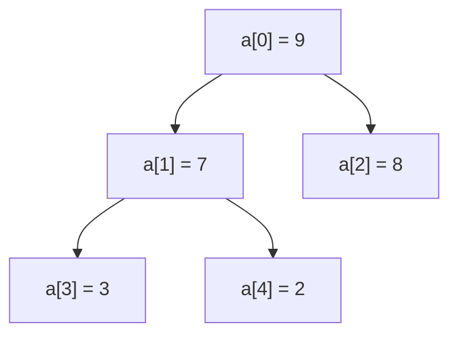

## 先明确稳定性与原地的含义

**排序**是按关键字顺序重新排列记录，既要有序，又必须保留原有全部记录且不重复增加。**升序**在有重复键时通常指非降序。**比较排序**只靠键之间的大小比较决定顺序；计数、基数等方法进一步利用键的范围或位结构。

**内部排序**指待排记录都能放入内存；**外部排序**指数据不能一次装入内存，必须借助外部存储。**趟**是算法的一轮主要处理，含义随算法而异，并不是每趟都把整个数组完全排序。**逆序对**是在原序列中前面的键大于后面的键的一对下标，它衡量乱序程度，与相等键的稳定性不是同一概念。

**辅助空间**是除约定输入输出外的额外存储。**分治**先把大问题分成更小问题、分别解决再组合；**枢轴**是快排用来划分键域的参照值；**归并**是将已有序的序列合成为更长有序序列，不是再对它们完整排序一次。

稳定排序保持相等关键字记录的原始相对次序。例如 `(2,A),(1,B),(2,C)` 排序后 A 应仍在 C 前。若只拿裸整数测试，看不出稳定性是否被破坏。

原地通常指只用常数级额外数据存储，但快排的递归栈要单独算，不能一面说原地一面忽略 $O(\log n)$ 甚至 $O(n)$ 调用栈。复杂度表必须说明实现与输入假设。

| 算法 | 最好 | 平均 | 最坏 | 辅助空间 | 常规实现稳定性 |
| --- | --- | --- | --- | --- | --- |
| 直接插入 | $O(n)$ | $O(n^2)$ | $O(n^2)$ | $O(1)$ | 稳定 |
| 带提前停止的冒泡 | $O(n)$ | $O(n^2)$ | $O(n^2)$ | $O(1)$ | 稳定 |
| 简单选择 | $O(n^2)$ | $O(n^2)$ | $O(n^2)$ | $O(1)$ | 不稳定 |
| 希尔 | 依增量序列 | 依增量序列 | 依增量序列 | $O(1)$ | 不稳定 |
| 堆排序 | $O(n\log n)$ | $O(n\log n)$ | $O(n\log n)$ | $O(1)$ | 不稳定 |
| 归并 | $O(n\log n)$ | $O(n\log n)$ | $O(n\log n)$ | 数组版 $O(n)$ | 可稳定 |
| 快排 | $O(n\log n)$ | 随机模型下 $O(n\log n)$ | $O(n^2)$ | 与递归策略有关 | 不稳定 |

表中的快排最好值指常见互异键二路划分模型；三路快排面对全相等键可单轮完成为 $O(n)$。不能把具体优化与常规表格不加区别地混用。希尔的减半增量最坏可达 $O(n^2)$，不能给所有增量统一写一个精确的 $O(n^{1.3})$。

## 简单排序：不变量不同，动作也不同

### 慢读：排序正确性有两个独立要求

首先，输出非降序；其次，输出记录的多重集合与输入相同。只验证第一条不够：把所有位置都写成0也“有序”，却丢失了数据。测试时与参考结果比较，或者额外检查元素及重数，才能发现这类问题。

稳定性讨论的是记录的身份，而不是数字本身。把相同分数的学生写成 `(80,甲)`、`(80,乙)`，比较函数只看分数；排序后甲乙先后不变才叫稳定。若排序时把姓名也纳入比较，得到的是新的排序规则，不能据此证明算法原本稳定。

插入排序处理 `[3,1,2]`：先假定只含3的前缀有序；取出1暂存，把3右移，将1写到最前；此时前缀 `[1,3]` 有序。再暂存2，移动3，遇1停止，把2放入中间。暂存变量保存了“正在挪动但还没落位”的记录，避免右移覆盖后丢失它。

### 比较次数和搬移次数不是同一个量

对已排序数组做插入，每个新元素比较一下便停，总时间线性。对逆序数组，第i次要挪动i个元素，总移动次数是 $1+2+\cdots+(n-1)=n(n-1)/2$。折半寻找插入点只减少“找位置”的比较，并不免除“腾位置”的数组搬移，所以总体仍可能平方级。

直接插入维护左侧已排序区，将当前记录插到合适位置。只在旧键**大于**新键时后移，遇相等就停，保持稳定。折半插入减少比较次数，但数组搬移仍可能 $O(n^2)$，不能因此把总时间改成 $O(n\log n)$。

冒泡通过相邻逆序交换，每轮把最大值推到尚未完成区域的末尾；整轮没交换即可结束。简单选择每轮从剩余区选最小值，通常与边界直接交换，可能跨过相等记录破坏稳定。例如 `(2,A),(2,B),(1,C)` 首轮交换后变 `(1,C),(2,B),(2,A)`。

希尔按 gap 分组做插入，最后 gap 必须为 1。早期长距离移动减少局部逆序，但也可能改变相等键顺序，因此一般不稳定。

### 同一个数组的前两趟：不要只看最后一个元素

固定升序目标，原数组[5,2,4,1,3]。这里“一趟”的定义随算法不同，必须先写规则：直接插入的一趟是把一个新元素并入有序前缀；冒泡的一趟是从左到右比较相邻元素，把较大者右移；简单选择的一趟是从剩余后缀选最小值换到前面。

| 算法 | 第一趟后 | 第二趟后 | 已经保证什么 |
| --- | --- | --- | --- |
| 直接插入 | 2,5,4,1,3 | 2,4,5,1,3 | 前2个、前3个位置分别有序，但不一定是全局最小的几个 |
| 向右冒泡 | 2,4,1,3,5 | 2,1,3,4,5 | 最大1个、最大2个元素就位 |
| 选择最小值放前端 | 1,2,4,5,3 | 1,2,4,5,3 | 最小1个、最小2个元素就位；第二趟可以不变 |

冒泡第一趟实际是5与2交换，再与4交换，再与1交换，再与3交换。插入第二趟则先取出4，比较5>4便把5右移，比较2>4为假便停，将4放入空位。两者都含比较和搬移，但保持的不变量不同。

用带身份的记录理解稳定性：2a、2b键都等于2，a/b只追踪原来先后，排序时不参与比较。直接插入若只搬移“严格大于”待插键的记录，2b不会越过2a；若改为“大于等于”，可能反转。选择排序对[2a,2b,1]第一趟把1与2a交换，得到[1,2b,2a]，所以普通交换式选择排序不稳定。

### 希尔排序：组员由下标间隔决定

希尔排序是对若干间隔子序列分别做插入排序，再缩小间隔。取[9,8,7,6,5,4,3,2]，增量依次4、2、1。增量4时四组下标为(0,4)、(1,5)、(2,6)、(3,7)，不是把前4项作为一组、后4项作为另一组。

| 增量 | 本趟分组并各自排序 | 写回原下标后的数组 |
| --- | --- | --- |
| 4 | [9,5]→[5,9]；[8,4]→[4,8]；[7,3]→[3,7]；[6,2]→[2,6] | 5,4,3,2,9,8,7,6 |
| 2 | 偶数下标[5,3,9,7]→[3,5,7,9]；奇数下标[4,2,8,6]→[2,4,6,8] | 3,2,5,4,7,6,9,8 |
| 1 | 全数组做插入排序 | 2,3,4,5,6,7,8,9 |

第一趟后整体仍无序并不表示算法失败，只要求每条间隔4的子序列有序。最后必须有增量1，才把局部性质转成全局有序。不同增量序列影响复杂度，不能给所有希尔排序统一套O(n log n)；跨组搬移也使它通常不稳定。

## 堆不是二叉搜索树

### 从数组下标推出树，而不是背图

零基下标的完全二叉树采用层序存放。结点i的左、右孩子候选下标是2i+1、2i+2；只有小于n才存在。非根结点的父下标是整数商(i-1)/2。最大堆要求每条父子边上父键不小于子键，既不要求左右兄弟有序，也不要求左子树所有键小于右子树。



```c
#include <assert.h>
#include <stdio.h>
int main(void) {
    const int a[] = {9, 7, 8, 3, 2};
    for (int child = 1; child < 5; ++child) {
        int parent = (child - 1) / 2;
        printf("parent[%d]=%d >= child[%d]=%d\n",
               parent, a[parent], child, a[child]);
        assert(a[parent] >= a[child]);
    }
    return 0;
}
```

<!-- study-run:BEGIN sha256=1cb4c7e4ef6e63ecc7f855c97f0437fa0fc9a93f7a2ffcd0548dbdcd0321d81d -->
本段代码的实测输出（GCC，C17；不代表所有输入）：

```text
parent[0]=9 >= child[1]=7
parent[0]=9 >= child[2]=8
parent[1]=7 >= child[3]=3
parent[1]=7 >= child[4]=2
```
<!-- study-run:END -->

这里验证4条边就覆盖了全部堆序条件，不必比较任意两结点。由根到任意结点的路径反复使用不等式传递性，才能推出根是全局最大值。数组仍不是降序数组：7后面是8。堆排序每次移出最大值以后还必须恢复堆序。

**堆**是满足局部堆序的完全二叉树：大根堆每个父键不小于孩子，小根堆反之。**优先队列**是支持插入和取出最高优先级元素的抽象接口，堆是它的一种实现。**下滤**是让一个可能过小的大根堆父键沿孩子方向下移，直至恢复堆序。它修复的是一条局部路径，前提是其孩子子树已经为堆。

大根堆只要求父键不小于孩子，左右子树之间没有全局大小顺序，中序遍历不保证有序。它用完全二叉树形状保证高度 $O(\log n)$，并用数组隐式保存链接。

0 基数组孩子为 2i+1、2i+2。自底向上建堆从最后一个非叶结点开始下滤。大多数结点高度很小，工作量为：

$$
\sum_{h\ge0}O\left(\frac{n}{2^{h+1}}h\right)=O(n).
$$

不能把 n 个结点都按下滤最坏 $O(\log n)$ 累加，误报标准自底向上建堆为 $O(n\log n)$。随后 n-1 次取最大值和恢复堆才产生排序总时间 $O(n\log n)$。

### 从数组建大根堆，再完整取出两次最大值

仍用[5,2,4,1,3]，下标从0开始。i的左孩子为2i+1、右孩子为2i+2，只有下标小于当前堆长的孩子才存在。最后一个非叶为floor(n/2)−1=1，按1、0倒序下滤；不是从最后一个叶子开始重复插入。

| 动作 | 数组（竖线右边不再属于堆） | 原因 |
| --- | --- | --- |
| 下滤i=1 | 5,3,4,1,2 | 孩子1、3中选较大3，与2交换 |
| 下滤i=0 | 5,3,4,1,2 | 根5已不小于两个孩子，建堆结束 |
| 根与堆尾交换，堆长减到4 | 2,3,4,1 \| 5 | 最大值5就位，但前缀还不是堆 |
| 对根下滤 | 4,3,2,1 \| 5 | 两个孩子3、4，必须选4上来 |
| 再交换根与堆尾，堆长减到3 | 1,3,2 \| 4,5 | 最大的两个键就位 |
| 对根下滤 | 3,1,2 \| 4,5 | 3上来，剩余前缀恢复堆 |

如果第一轮下滤选了较小的孩子3，根3下面还压着4，堆性质仍被破坏；选择较大孩子不是性能偏好，而是正确性要求。已排好的尾部必须排除在下滤范围之外，否则可能把5重新换回来。

堆只保证父键不小于孩子，不保证左孩子比右孩子小，也不保证数组整体有序。本例建堆O(n)，之后每次取最大值O(log n)，总排序O(n log n)；不能把建堆误计成“每个结点都从根下滤一次”。

## 归并：稳定来自相等时的选择

递归把数组分成两个已排序段，再用两个指针线性合并。两段头部相等时先取左边，因为左段记录原先就在右段记录之前。若写成严格小于并在相等时取右边，会破坏跨段相等记录的稳定性。

链表归并可通过重新连接结点减少额外数组需求；数组版通常用 $O(n)$ 缓冲区。面试回答“归并空间是多少”时，应先说明数组还是链表、递归还是迭代。

## 快排：划分正确不等于不退化

二路快排选枢轴，划分后递归处理两边。若每次只分出一个元素，就有 $T(n)=T(n-1)+O(n)=O(n^2)$。随机枢轴或三数取中能改善常见情况，但不能把所有实现的最坏界说成对数线性。

三路划分维护 `<pivot`、`==pivot`、未知、`>pivot` 四段。相等区无需递归，特别适合重复键。交换未知元素与右侧元素后，当前位置换来的数尚未检查，i 不能直接加一。

下面程序只递归较小一边，较大一边用循环继续。这样即使时间退化，递归栈仍可控制在 $O(\log n)$，但**并没有消除最坏 $O(n^2)$ 时间**。

## 完整 C 程序：七种比较排序及统一测试

### 不要一次读完七个函数

先读swap和insertion，把一个算法跟完，再读其他算法。`int a[]`形参在这里按指针处理，函数直接修改调用者数组，n由调用者另传；并没有自动获得数组长度。swap收两个元素的地址，因此能交换原数组里的数，而不是只交换两个形参副本。

插入排序里key保存本轮要插入的数，j表示当前空位。`a[j]=a[j-1]`把较大旧元素向右移，`--j`让空位左移；循环结束再把key填回空位。这是移动元素，不是每次把整个数组复制一份。

### 下滤为什么先选较大的孩子

大根堆要求父亲不小于两个孩子。假设父亲2、左孩子9、右孩子7，如果只与7交换，父亲变7仍小于9，堆序没有恢复；必须与较大的9比较并交换。交换后当前位置满足要求，但2到了更下面，可能仍小于自己的孩子，所以继续沿那条路径修复。

`child=2*root+1`先指向左孩子；右孩子存在且更大时再`++child`。n代表当前堆的元素个数，不一定是原数组长度。堆排序把最大值移到末尾后调用`sift_down(...,end-1)`，故已排好的末尾不再参加堆操作。若仍传原长度，就会把已经排好的元素又拉回来。

### 三路快排的四个区间怎样移动

程序维护`[lo,lt)`小于pivot、`[lt,i)`等于pivot、`[i,gt)`未知、`[gt,hi)`大于pivot。边界不是四个具体元素，而是四段的分界；空区间也合法。pivot保存一个数值副本，即使原位置里的元素被交换，这个参照值仍不变。

用 `[3,2,1,2]`、pivot=2手推划分规则（为观察规则，这里直接指定pivot，完整程序按中点取）：

| 动作 | 数组 | lt,i,gt | 已发生的事 |
| --- | --- | --- | --- |
| 初始 | 3,2,1,2 | 0,0,4 | 全部未知 |
| 3大于2，先减gt再交换 | 2,2,1,3 | 0,0,3 | 3进入大于区，换来的2尚未检查 |
| 2等于pivot | 2,2,1,3 | 0,1,3 | 等于区扩大 |
| 下一个2也相等 | 2,2,1,3 | 0,2,3 | 等于区继续扩大 |
| 1小于2，与lt位置交换 | 1,2,2,3 | 1,3,3 | 未知区为空，划分完成 |

大于分支不能立即i++，因为从右边换来的元素原属未知区；它可能是小值。小于分支同时lt++和i++，则是因为换到i处的是已经确认过的等值元素（或lt=i时自交换），没有遗漏未知元素。

等于区已经就位，不参与递归。较小区间递归、较大区间用while继续，是为了控制调用栈；它不保证划分总是均衡，所以不能据此宣称最坏时间也优化了。

### 归并里的三个下标各自走哪一段

i走左段`[lo,mid)`，j走右段`[mid,hi)`，k走临时数组的输出位置。两边都还有数时比较两个段首，把更小的写到tmp[k]；相等取左边保证跨段稳定。某边耗尽后，另一边本来就有序，只需顺序复制，不必继续比较两边。

`tmp[k++] = a[i] <= a[j] ? a[i++] : a[j++]`虽短，却含好几个动作：比较当前段首→只从选中一边取数→那一边游标加1→输出游标加1。条件运算符只执行被选中的分支，所以不会同时把i和j都加1。初学时把这一句在纸上展开，比猜三个加号发生顺序更安全。

### main里的函数指针数组可以最后再读

`void (*sorts[])(int *, size_t)`表示“存放排序函数地址的数组”，每个函数都接收整数数组地址和长度，返回void。`sorts[f](a,8)`调用第f种排序，让相同测试数据经过不同算法。它只是统一测试的工具，不是理解插入或堆排序的前提。

memcpy在每次测试前复制样本，避免第一种排序改过的数组被第二种误当原始输入；qsort生成参照结果，memcmp比较结果字节是否相同。本例是同类型整数样本的实际实现测试，不据此证明所有记录类型的稳定性。

为方便复现，归并缓冲区最多 256 个整数，main 的测试样本更小；其他算法以传入数组和长度为约定。输入数组有效，n=0 时允许空指针。merge_sort 在容量不足时返回 false。

所有函数直接修改数组，没有另返回一份排序结果。快排区间是 `[lo,hi)`，lt、i、gt 分别标出小于区末端、未知区起点、大于区起点；归并的 i、j 是两个输入段游标，k 是输出游标。以 `[3,1,2]` 为例，插入处理 1 后为 `[1,3,2]`，再把 3 后移插入 2；归并则先形成有序子段，再比较两段段首。相同结果来自不同的中间状态。

```c
#include <assert.h>
#include <stdbool.h>
#include <stddef.h>
#include <stdio.h>
#include <stdlib.h>
#include <string.h>

void swap(int *a, int *b) { int t = *a; *a = *b; *b = t; }
void insertion(int a[], size_t n) {
    for (size_t i = 1; i < n; ++i) {
        int key = a[i]; size_t j = i;
        while (j > 0 && a[j-1] > key) { a[j] = a[j-1]; --j; }
        a[j] = key;
    }
}
void bubble(int a[], size_t n) {
    for (size_t end = n; end > 1; --end) {
        bool changed = false;
        for (size_t i = 1; i < end; ++i)
            if (a[i-1] > a[i]) { swap(&a[i-1], &a[i]); changed = true; }
        if (!changed) break;
    }
}
void selection(int a[], size_t n) {
    for (size_t i = 0; i < n; ++i) {
        size_t best = i;
        for (size_t j = i+1; j < n; ++j) if (a[j] < a[best]) best = j;
        swap(&a[i], &a[best]);
    }
}
void shell(int a[], size_t n) {
    for (size_t gap = n/2; gap > 0; gap /= 2)
        for (size_t i = gap; i < n; ++i) {
            int key = a[i]; size_t j = i;
            while (j >= gap && a[j-gap] > key) { a[j] = a[j-gap]; j -= gap; }
            a[j] = key;
        }
}
void sift_down(int a[], size_t root, size_t n) {
    while (root < n/2) {
        size_t child = 2*root+1;
        if (child+1 < n && a[child+1] > a[child]) ++child;
        if (a[root] >= a[child]) return;
        swap(&a[root], &a[child]); root = child;
    }
}
void heap_sort(int a[], size_t n) {
    for (size_t i = n/2; i > 0; --i) sift_down(a, i-1, n);
    for (size_t end = n; end > 1; --end) {
        swap(&a[0], &a[end-1]); sift_down(a, 0, end-1);
    }
}
void quick_part(int a[], size_t lo, size_t hi) {
    while (hi-lo > 1) {
        int pivot = a[lo+(hi-lo)/2];
        size_t lt = lo, i = lo, gt = hi;
        while (i < gt) {
            if (a[i] < pivot) { swap(&a[lt], &a[i]); ++lt; ++i; }
            else if (a[i] > pivot) { --gt; swap(&a[i], &a[gt]); }
            else ++i;
        }
        if (lt-lo < hi-gt) { quick_part(a, lo, lt); lo = gt; }
        else { quick_part(a, gt, hi); hi = lt; }
    }
}
void quick_sort(int a[], size_t n) { quick_part(a, 0, n); }
void merge_part(int a[], int tmp[], size_t lo, size_t hi) {
    if (hi-lo < 2) return;
    size_t mid = lo+(hi-lo)/2;
    merge_part(a, tmp, lo, mid); merge_part(a, tmp, mid, hi);
    size_t i = lo, j = mid, k = lo;
    while (i < mid && j < hi) tmp[k++] = a[i] <= a[j] ? a[i++] : a[j++];
    while (i < mid) tmp[k++] = a[i++];
    while (j < hi) tmp[k++] = a[j++];
    for (k = lo; k < hi; ++k) a[k] = tmp[k];
}
bool merge_sort(int a[], size_t n) {
    if (n > 256) return false;
    int tmp[256]; merge_part(a, tmp, 0, n); return true;
}
int compare(const void *a, const void *b) {
    int x = *(const int *)a, y = *(const int *)b;
    return (x > y)-(x < y);
}
int main(void) {
    void (*sorts[])(int *, size_t) = {insertion, bubble, selection, shell, heap_sort, quick_sort};
    int samples[][8] = {{3,-1,3,0,9,2,2,1}, {1,2,3,4,5,6,7,8},
                       {8,7,6,5,4,3,2,1}, {2,2,2,2,2,2,2,2}};
    for (size_t s = 0; s < 4; ++s) {
        int expected[8]; memcpy(expected, samples[s], sizeof expected);
        qsort(expected, 8, sizeof expected[0], compare);
        for (size_t f = 0; f < sizeof sorts/sizeof sorts[0]; ++f) {
            int a[8]; memcpy(a, samples[s], sizeof a); sorts[f](a, 8);
            assert(memcmp(a, expected, sizeof a) == 0);
            sorts[f](NULL, 0);
        }
        int a[8]; memcpy(a, samples[s], sizeof a);
        assert(merge_sort(a, 8) && memcmp(a, expected, sizeof a) == 0);
    }
    assert(merge_sort(NULL, 0));
    puts("comparison sorting tests passed"); return 0;
}
```

<!-- study-run:BEGIN sha256=6d5409f791b99aca44ee268dc25106d3aae2f7fad440b0b1dd5978ac85b36bec -->
本段代码的实测输出（GCC，C17；不代表所有输入）：

```text
comparison sorting tests passed
```
<!-- study-run:END -->

这些测试验证顺序正确，不验证记录稳定性。稳定性可在插入、冒泡、归并版本中把数据换成 `{key, original_index}`，比较时只看 key，再检查相等键的 original_index 是否递增。C 标准库 qsort 不承诺稳定，也不保证一定是快速排序；这里只把它用作整数有序结果的参照。

## 比较排序下界与非比较排序

### 从递推式读出归并与快排的差异

平衡归并每层处理的元素总数约为n，共约log₂n层，故 $T(n)=2T(n/2)+\Theta(n)=\Theta(n\log n)$。关键是**同一层所有子问题加起来**的代价，不是每个结点都另乘一次n。

快排最坏可能每轮只确定一个枢轴，剩下n-1个继续处理，形成 $T(n)=T(n-1)+\Theta(n)$，展开是等差数列，得到平方级。这两种算法都使用递归，但递归不是某一种复杂度；决定代价的是子问题规模、个数及合并/划分成本。

建堆的线性上界可以借助收敛级数理解：高度为h的结点数量按约 $n/2^{h+1}$ 衰减，而每个最多下滤h层；$\sum h/2^h$ 收敛，所以总量是n乘一个常数。不能让所有叶子也承担“从根走到底”的最坏费用。

互异 n 个键有 n! 种排列，比较判定树至少 n! 个叶子，高度至少 $\log_2(n!)=\Omega(n\log n)$。这是比较模型下界，不限制利用键值结构的计数和基数排序。

计数排序适合键范围大小 K 可控，时间 $O(n+K)$、额外空间通常 $O(n+K)$。负数可平移，但键域跨度计算也可能溢出。LSD 基数排序按低位到高位，**每一趟必须稳定**，否则高位相同的记录会破坏已建立的低位顺序。d 位、基数 r 时常记 $O(d(n+r))$，不能无条件简写为 O(n)。

## 完整 C 程序：非负整数十进制 LSD

### 为什么从个位开始不会把大小排乱

以21、13、12为例，个位稳定排序后为21、12、13；再按十位稳定排序，十位1的12、13保持之前的个位顺序，得到12、13、21。第二轮不是忘掉个位，而是在十位相同的组内保留个位已经建立的顺序。如果第二轮把12、13反过来，前一轮成果就丢了，这正是“每轮必须稳定”的具体原因。

计数数组先记录各数字出现次数，前缀和再把“数量”改成“这组记录在输出数组中的结束位置”。放置某个数字d时先将该结束位置减1，再放入元素；从输入右向左处理，后来的同数字记录先占较右位置，原先较早的最终仍在左边。前缀和是分配目标位置的工具，不是另一次按原数值求和。

最多 128 个 unsigned 整数；用前缀和加从右到左分配保持每一趟稳定。exp 的更新先检查最大键剩余位数，避免乘 10 溢出。本例不处理带负号整数。

```c
#include <assert.h>
#include <stdbool.h>
#include <stddef.h>
#include <stdio.h>

bool radix_sort(unsigned a[], size_t n) {
    if (n > 128 || (n != 0 && a == NULL)) return false;
    if (n == 0) return true;
    unsigned max = a[0], tmp[128];
    for (size_t i = 1; i < n; ++i) if (a[i] > max) max = a[i];
    for (unsigned exp = 1;;) {
        size_t count[10] = {0};
        for (size_t i = 0; i < n; ++i) ++count[(a[i]/exp)%10];
        for (size_t d = 1; d < 10; ++d) count[d] += count[d-1];
        for (size_t i = n; i > 0; --i) {
            unsigned key = a[i-1]; tmp[--count[(key/exp)%10]] = key;
        }
        for (size_t i = 0; i < n; ++i) a[i] = tmp[i];
        if (max/exp < 10) break;
        exp *= 10;
    }
    return true;
}
int main(void) {
    unsigned a[] = {170,45,75,90,802,24,2,66,0,45};
    assert(radix_sort(a, 10));
    for (size_t i = 1; i < 10; ++i) assert(a[i-1] <= a[i]);
    assert(radix_sort(NULL, 0));
    puts("radix tests passed"); return 0;
}
```

<!-- study-run:BEGIN sha256=538bf057ffde755ff38e2633d771704c7b8ed2f90c3049ae23af068fcb438bb1 -->
本段代码的实测输出（GCC，C17；不代表所有输入）：

```text
radix tests passed
```
<!-- study-run:END -->

## 外部排序：瓶颈从比较转向 I/O

本讲保留小规模数组模拟帮助读懂状态。进一步的M记录堆式置换选择、任意k路败者回放、真实临时文件及失败清理，已在[第十四讲：文件外排序](/notes/data-structures/14-external-sort-files)实现；不要把模拟版与文件版的资源成本混为一谈。

**块**是这里计数的外部数据传输单位，**缓冲区**是在内存中暂存输入/输出块的空间，**有序段（run）**是已按键排序、后续可参与归并的一段记录。**k 路归并**同时从 k 个有序输入段中选择当前最小记录输出，而不是同时运行 k 次完整排序。**I/O** 指数据在内存与外部存储之间的读写，本节单位是块，不是单条记录。

当数据无法一次装入内存，不能把数组快排直接扩展为不断随机访问磁盘。外部归并先生成能放入内存的有序初始段，再多路顺序归并。运行时间高度依赖块传输、缓冲区和归并趟数，而非只看比较次数。

设总数据占 N 个块，内存可同时容纳 B 个块：简单初始段生成得到 $R=\lceil N/B\rceil$ 段。理想情况下 B-1 块用于不同输入段，1 块用于输出，因此最多 B-1 路归并。每一趟完整读写数据约 2N 次块传输。若 B>=3、R>1，需要：

$$
p=\left\lceil\log_{B-1} R\right\rceil
$$

趟归并，总块传输约 $2N(1+p)$，包括初始段生成。最后结果若直接流水交给下游、不落盘，可少一次最终写入；这是另一种计数约定。

例：N=1000 块、B=11 块，初始 91 段，10 路归并两趟，约 $2\times1000\times3=6000$ 次块传输。路数越大并非无限好：还需要归并选择结构、每路缓冲与设备吞吐，不能忽略内存预算。

### 败者树解决选择最小段首

先把“记录数”和“块数”分别标在草稿纸上。若一个块装100条记录，读取1000条连续记录约需10个块，而不是1000次块I/O。多路归并的段数递推是 $R_{j+1}=\lceil R_j/k\rceil$；前例91段十路归并先变10段，再变1段。这比直接背对数更便于处理向上取整。

内存块数B还不是全给输入：留1块输出时最多B-1个输入缓冲。若实现还要预留其他缓冲或选择结构，就不能机械使用B-1路。理论题先服从题目给的理想模型，工程实现再列真实内存预算。


k 路归并每次只需比较各输入段当前最小记录。朴素逐路扫描每输出一个记录 O(k)；小根堆或败者树将更新代价降到 O(log k)。败者树保存比赛中的失败者，胜者沿路径向上，替换一个叶子只需重赛其到根路径。它减少的是 CPU 选择代价，不直接改变固定路数下的读写数据量。

### 置换选择为什么可能产生更长初始段

内存保持一个小根堆，输出最小值后读入新记录。若新键不小于刚输出的键，可继续参加当前段；否则冻结到下一段。当当前活跃堆空了，本段结束，解冻后开始新段。

随机独立、适当连续键分布下，初始段平均长度常接近内存记录数 M 的两倍，但**不是保证每段都有 2M**。逆序输入可能只生成约 M 长度，已排序输入可形成很长甚至完整一段。不要把 M 个记录与 B 个块混用单位。相关机制可对照 [OpenDSA 外部排序](https://opendsax.cs.vt.edu/OpenDSA/Books/Everything/html/ExternalSort.html)。

### 最佳归并树为什么又遇见哈夫曼

若有序段长度不同，二路合并一次的搬运代价与两段长度之和成正比，反复合并最短两段可最小化总搬运量，正是哈夫曼式最佳归并模式。多路版本若要求满 k 叉归并树，需要满足叶子数模条件，必要时补零权虚段；不要把二路贪心代码不加调整地当成任意路归并。

### 外排完整手算：先列段数，再数读写

设文件1000块，内存11块，使用简单分批排序，每个初始段最多11块；归并预留1块输出，其余10块各给一个输入段。忽略索引结构额外占用，最终结果必须写回文件，每趟所有数据都读写一次。

| 阶段 | 段数如何变 | 本阶段块I/O |
| --- | --- | --- |
| 生成初始段 | 1000=90×11+10，得到91段 | 读1000+写1000=2000 |
| 第一趟10路归并 | 91→ceil(91/10)=10 | 2000 |
| 第二趟10路归并 | 10→1 | 2000 |
| 合计 | 一次段生成、两趟归并 | 6000 |

第一趟最后一组只有一段，本表仍按“本趟全部复制到新文件”的模型计费。工程中若直接复用该段文件而不复制，代价会不同，应另列模型。不能一方面套每趟2N，另一方面暗中省掉某些段而仍称精确值。

自编变式：内存改为6块，同一模型下初始段ceil(1000/6)=167，归并最多5路，段数167→34→7→2→1，共四趟归并，总I/O为2×1000×5=10000。答案里的5是“1次生成+4趟归并”，不是归并路数碰巧也等于5。

### 置换选择：冻结的是参加资格，不是把数丢掉

内存最多容纳3条候选记录，输入依次为4、1、3、2、6、0、5、7、2。初始读入4、1、3。活跃集合参加当前段最小值竞争，冻结集合留给下一段；下面用升序集合写状态以便手推，不表示真实堆数组总是排好序。

| 当前输出 | 随后读入 | 活跃候选 | 冻结候选 | 判断 |
| --- | --- | --- | --- | --- |
| 初始 | 4、1、3 | 1,3,4 | 空 | 尚未输出 |
| 1 | 2 | 2,3,4 | 空 | 2≥1，可继续 |
| 2 | 6 | 3,4,6 | 空 | 6≥2，可继续 |
| 3 | 0 | 4,6 | 0 | 0<3，不能放在当前段3后面 |
| 4 | 5 | 5,6 | 0 | 5≥4 |
| 5 | 7 | 6,7 | 0 | 7≥5 |
| 6 | 2 | 7 | 0,2 | 2<6，冻结 |
| 7 | 已到文件末尾 | 空 | 0,2 | 活跃空，第一段结束 |
| 新段开始 | 不再读取 | 0,2 | 空 | 解冻，重置当前段下界 |
| 0、2 | 无 | 空 | 空 | 第二段结束 |

得到第一段[1,2,3,4,5,6,7]、第二段[0,2]，共9条，两个2都保留。第一段长7大于2M=6，说明“平均约2M”不是上限。每次输出腾一个位置，再读一条新记录；活跃加冻结数量始终不超过3，不能为了生成长段偷偷扩大内存。

### 败者树四路比赛：为什么更新只走一条路径

四个已排序输入段为R0=[1,9]、R1=[4,6]、R2=[2,5]、R3=[8,10]。段首是各段尚未输出的第一个记录，初始为1、4、2、8；“胜者”定义为较小的键。记录来源段号也必须保留，否则输出1之后不知道该推进哪一段。

第一轮：R0与R1比，1胜、4败；R2与R3比，2胜、8败；两个胜者再比，1胜、2败。内部三个比赛位置分别记录败者4、8、2，最终冠军1单独保存。相等键可按段号破同分，使比较规则确定。

输出1后，只把R0段首替换为9。从原来1的路径重赛：9与下层保存的4比，4胜、该位置改存9；4与上层保存的2比，2胜、上层改存4。新冠军来自R2。另一半“2与8的比赛”不必重做，因为其候选未变。输出2后R2段首改为5，再沿它的路径与8、4比赛，冠军成为4。

初始化四路需要3次比较；本例每次替换走2层，一般平衡选择树更新O(log k)。这里讲的是机制，不提供完整败者树实现。耗尽段应标记为不再参赛（概念上正无穷）；若真实键可取最大整数，代码不能不加区分地用最大整数充当哨兵。

### 完整 C 程序：先用三个槽看清置换选择

先把“挑选最小值”与“冻结规则”拆开。下面固定M=3个候选槽，每次扫描这3个槽选活跃最小值；这样不用同时理解堆重排与冻结，就能验证上面的9记录例子。它实现置换选择的规则，但不是小根堆优化版：推广到M个槽时，选取代价为O(M)，总时间O(nM)，不能把本段代码标成O(n log M)。

每个Slot有key、used、frozen三部分：used表示此槽有尚未输出的记录；frozen表示这条记录不能参与当前段。未使用槽的key可能仍留着旧数，不能仅凭key判断槽是否有效。input表示有限输入流的内存替身，Result只是测试时收集输出的容器；真实外排应逐条读、逐条写文件，不把整个文件放进Result。

| 变量 | 始终表达的意思 |
| --- | --- |
| next | 下一条还没有读入候选区的输入位置 |
| live | 候选区尚未输出的记录数，包含冻结记录 |
| best | 当前最小活跃记录所在槽；等于M表示没有找到 |
| boundary[r] | 第r段在收集结果中的起点；最后另存一个总长度边界 |
| last | 刚刚输出的键，新读入键与它比较决定是否冻结 |

找不到活跃记录但live不为0时，说明剩下的记录都冻结了，不是输入已经全部结束。此时记录段边界、解冻，再开始下一段。live为0才意味着候选区清空；由于每次输出后只要输入未完就立即补入一条，正常流程下这也意味着输入已耗尽。

接口拒绝超过64条的测试输入；返回false前不更改Result。n=0时段数0、boundary[0]=0；非空结果若有r段，使用boundary[0..r]划出r个半开区间。段边界不是记录中的特殊数，因此输入允许负数、INT_MIN和INT_MAX。

```c
#include <assert.h>
#include <stdbool.h>
#include <stddef.h>
#include <stdio.h>
#include <stdlib.h>
#include <limits.h>

enum { M = 3, CAP = 64 };
typedef struct { int key; bool used, frozen; } Slot;
typedef struct {
    int value[CAP];
    size_t boundary[CAP + 1], count, runs;
} Result;

bool make_runs(const int input[], size_t n, Result *out) {
    if (out == NULL || n > CAP || (n != 0 && input == NULL)) return false;
    *out = (Result){0};
    Slot slot[M] = {{0}};
    size_t next = 0, live = 0;
    for (size_t i = 0; i < M && next < n; ++i) {
        slot[i] = (Slot){input[next++], true, false};
        ++live;
    }
    while (live != 0) {
        size_t best = M;
        for (size_t i = 0; i < M; ++i) {
            if (!slot[i].used || slot[i].frozen) continue;
            if (best == M || slot[i].key < slot[best].key) best = i;
        }
        if (best == M) {
            out->boundary[++out->runs] = out->count;
            for (size_t i = 0; i < M; ++i) slot[i].frozen = false;
            continue;
        }
        int last = slot[best].key;
        out->value[out->count++] = last;
        if (next < n) {
            int incoming = input[next++];
            slot[best] = (Slot){incoming, true, incoming < last};
        } else {
            slot[best].used = false;
            --live;
        }
    }
    if (out->count != 0) out->boundary[++out->runs] = out->count;
    return true;
}
int compare_int(const void *a, const void *b) {
    int x = *(const int *)a, y = *(const int *)b;
    return (x > y) - (x < y);
}
void verify(const int input[], size_t n, const Result *r) {
    assert(r->count == n && r->boundary[0] == 0);
    assert(r->boundary[r->runs] == n);
    assert((n == 0) == (r->runs == 0));
    for (size_t run = 0; run < r->runs; ++run) {
        size_t begin = r->boundary[run], end = r->boundary[run + 1];
        assert(begin < end && end <= n);
        for (size_t i = begin + 1; i < end; ++i)
            assert(r->value[i - 1] <= r->value[i]);
    }
    int before[CAP], after[CAP];
    for (size_t i = 0; i < n; ++i) { before[i] = input[i]; after[i] = r->value[i]; }
    qsort(before, n, sizeof before[0], compare_int);
    qsort(after, n, sizeof after[0], compare_int);
    for (size_t i = 0; i < n; ++i) assert(before[i] == after[i]);
}
int main(void) {
    int sample[] = {4,1,3,2,6,0,5,7,2};
    int expected[] = {1,2,3,4,5,6,7,0,2};
    Result r;
    assert(make_runs(sample, 9, &r)); verify(sample, 9, &r);
    assert(r.runs == 2 && r.boundary[1] == 7 && r.boundary[2] == 9);
    for (size_t i = 0; i < 9; ++i) assert(r.value[i] == expected[i]);
    int descending[] = {9,8,7,6,5,4,3,2,1};
    assert(make_runs(descending, 9, &r)); verify(descending, 9, &r);
    assert(r.runs == 3 && r.boundary[1] == 3 && r.boundary[2] == 6);
    int extremes[] = {INT_MAX, INT_MIN, 0, INT_MIN, INT_MAX};
    assert(make_runs(extremes, 5, &r)); verify(extremes, 5, &r);
    assert(make_runs(NULL, 0, &r)); verify(NULL, 0, &r);
    assert(!make_runs(NULL, 1, &r));
    size_t cases = 0;
    for (size_t n = 0, total = 1; n <= 6; ++n, total *= 3) {
        for (size_t mask = 0; mask < total; ++mask) {
            int input[6]; size_t code = mask;
            for (size_t i = 0; i < n; ++i) {
                input[i] = (int)(code % 3) - 1; code /= 3;
            }
            assert(make_runs(input, n, &r)); verify(input, n, &r);
            ++cases;
        }
    }
    assert(cases == 1093);
    puts("replacement selection: traces and 1093 invariant cases passed");
    return 0;
}
```

<!-- study-run:BEGIN sha256=54558d62851061ebf436d831ec3261321ec72712704bf100b1958817cfe06c59 -->
本段代码的实测输出（GCC，C17；不代表所有输入）：

```text
replacement selection: traces and 1093 invariant cases passed
```
<!-- study-run:END -->

验证器同时检查每段非降序、段边界连续有效，以及输入输出多重集一致。最后一项必须保留重复次数：只把元素放进集合比较，会漏掉“两个2变成一个2”的错误。测试用qsort是为了独立检查记录没有丢失，不是生成有序段时偷偷使用全量排序。

如果下一步改用小根堆，可把“是否属于当前段”作为比键值更高优先级的比较条件，活跃记录排在冻结记录前；或分别管理两部分。无论哪种实现，M个候选的总预算不能翻倍。当前代码故意先展示线性扫描版，以便看清这两个独立职责。

### 完整 C 程序：四路败者树归并

这个程序处理四个已经非降序的输入段，输出所有记录并保留重复；只实现归并选择，不负责生成初始段。每个Run的data指向原数组，n是该段长度，pos是下一条未输出记录的位置。pos==n表示耗尽，**不靠某个特殊整数表示耗尽**。

比赛树采用下标：内部结点1、2、3，四个叶位置4、5、6、7，叶位置减4就是来源段号。loser[p]保存第p场比赛的败者段号，不是败者键值，也不是树结点指针。初始化递归build先让左右比赛结束，再比较两边胜者，将败者留在当前格，返回胜者。

比较函数before先比较是否有有效记录：有效者胜过耗尽者；都有记录则键小者胜；键相等或都耗尽则段号小者胜，保持结果确定。不能先读耗尽段的data[pos]再判断是否有效，那已经可能越界。

每次只允许推进**上一轮总冠军所在段**，再调用replay。这是算法前提：冠军到根路径上，每一场保存的败者都是另一侧子树的胜者；这些段没有变化，才可以逐层重赛。如果任意修改非冠军段而复用此函数，不能保证得到正确新冠军。

```c
#include <assert.h>
#include <stdbool.h>
#include <stddef.h>
#include <stdio.h>
#include <limits.h>

enum { K = 4 };
typedef struct { const int *data; size_t n, pos; } Run;
typedef struct {
    Run run[K];
    int loser[K], winner;
} LoserTree;

bool before(const LoserTree *t, int a, int b) {
    const Run *x = &t->run[a], *y = &t->run[b];
    bool ax = x->pos < x->n, by = y->pos < y->n;
    if (ax != by) return ax;
    if (ax && x->data[x->pos] != y->data[y->pos])
        return x->data[x->pos] < y->data[y->pos];
    return a < b;
}
int play(LoserTree *t, int place, int a, int b) {
    if (before(t, a, b)) { t->loser[place] = b; return a; }
    t->loser[place] = a;
    return b;
}
int build(LoserTree *t, int place) {
    if (place >= K) return place - K;
    int a = build(t, place * 2);
    int b = build(t, place * 2 + 1);
    return play(t, place, a, b);
}
void replay(LoserTree *t, int changed) {
    int candidate = changed;
    for (int place = (K + changed) / 2; place >= 1; place /= 2) {
        int opponent = t->loser[place];
        candidate = play(t, place, candidate, opponent);
    }
    t->winner = candidate;
}
size_t merge_four(const int *data[K], const size_t lengths[K],
                  int output[], size_t capacity) {
    LoserTree t = {0};
    size_t total = 0;
    for (int i = 0; i < K; ++i) {
        assert(lengths[i] == 0 || data[i] != NULL);
        assert(lengths[i] <= capacity - total);
        total += lengths[i];
        for (size_t j = 1; j < lengths[i]; ++j)
            assert(data[i][j - 1] <= data[i][j]);
        t.run[i] = (Run){data[i], lengths[i], 0};
    }
    assert(total == 0 || output != NULL);
    t.winner = build(&t, 1);
    size_t count = 0;
    while (t.run[t.winner].pos < t.run[t.winner].n) {
        int source = t.winner;
        Run *r = &t.run[source];
        output[count++] = r->data[r->pos++];
        replay(&t, source);
    }
    assert(count == total);
    return count;
}
int main(void) {
    int a[] = {1,9}, b[] = {4,6}, c[] = {2,5}, d[] = {8,10};
    const int *data[K] = {a,b,c,d};
    size_t lengths[K] = {2,2,2,2};
    int output[8], expected[] = {1,2,4,5,6,8,9,10};
    assert(merge_four(data, lengths, output, 8) == 8);
    for (size_t i = 0; i < 8; ++i) assert(output[i] == expected[i]);
    int edge[] = {INT_MIN,5,INT_MAX}, five[] = {5}, max[] = {INT_MAX};
    const int *mixed[K] = {edge,NULL,five,max};
    size_t mixed_lengths[K] = {3,0,1,1};
    assert(merge_four(mixed, mixed_lengths, output, 8) == 5);
    assert(output[0] == INT_MIN && output[1] == 5 && output[2] == 5);
    assert(output[3] == INT_MAX && output[4] == INT_MAX);
    const int *empty[K] = {NULL,NULL,NULL,NULL};
    size_t zero[K] = {0,0,0,0};
    assert(merge_four(empty, zero, NULL, 0) == 0);
    /* 枚举每段为空或含一个-1/0/1，共4^4种输入。 */
    for (unsigned mask = 0; mask < 256; ++mask) {
        unsigned code = mask;
        int values[K], small_output[K], frequencies[3] = {0,0,0};
        const int *one[K]; size_t sizes[K], count = 0;
        for (int i = 0; i < K; ++i) {
            unsigned state = code % 4; code /= 4;
            values[i] = state == 0 ? 0 : (int)state - 2;
            one[i] = &values[i]; sizes[i] = state == 0 ? 0 : 1;
            if (sizes[i] != 0) { ++frequencies[values[i] + 1]; ++count; }
        }
        assert(merge_four(one, sizes, small_output, K) == count);
        for (size_t i = 0; i < count; ++i) {
            if (i != 0) assert(small_output[i - 1] <= small_output[i]);
            --frequencies[small_output[i] + 1];
        }
        for (int i = 0; i < 3; ++i) assert(frequencies[i] == 0);
    }
    puts("loser-tree merge: traces, extremes and 256 small cases passed");
    return 0;
}
```

<!-- study-run:BEGIN sha256=1be1405206a79865466fe24beff9e98cb70b7f8b9ce37faac477507817e92c46 -->
本段代码的实测输出（GCC，C17；不代表所有输入）：

```text
loser-tree merge: traces, extremes and 256 small cases passed
```
<!-- study-run:END -->

重点慢读replay：changed永远是刚推进的来源段，决定从哪个叶子的父亲开始；candidate则可能在途中换成另一段的胜者。路径不用跟着candidate重新选，因为我们正在重新决定“原先发生改变的那棵子树”每一级的新胜者。到更高一层时，另一侧依然由该格原存的opponent代表。

归并正确性来自两个事实：各输入段本身有序，因此段首是该段剩余记录的最小者；比赛树维护所有有效段首的最小者。每次输出全局最小剩余记录并仅推进其来源段，所以输出非降序且每条恰好一次。一般k路初始化O(k)、每条更新O(log k)，总O(k+N log k)，选择结构额外空间O(k)；这里K固定4，实际每次重赛两层。

本例要求输出容量足够且不与输入重叠，用断言表达调用前提，并不是带错误恢复的文件接口。长度先与capacity−total比较再累加，避免总长度加法先溢出。实际外排还需加入缓冲块读写、I/O失败、临时文件清理等，本程序没有处理这些，不应称为磁盘排序器。

### 最佳归并与“补零段”的完整数值题

有4个有序段，长度为2、3、7、8块。一次合并读入所有输入块并写出等长结果，成本为合并总长度的两倍，忽略末块未满等效应。

二路最佳归并：2+3=5，5+7=12，12+8=20，合并长度之和37，I/O为74。若先2+8=10、3+7=10，最后10+10=20，总长度40，I/O为80。差别来自短段被重复搬运的层数；不是最终文件长度不同，最终都是20块。

改成最多三路，想用满三叉树模型时需叶数L满足(L−1)能被3−1整除。理由是每个内部结点都有3个孩子，若内部结点数为I，边数同时为3I和I+L−1，因此L−1=2I。4个实段需补一个长度0的虚段，变为5个叶子。

先合并0、2、3得到5，再合并5、7、8得到20，总合并长度25、I/O为50。虚段无需真实读写，第一步实际只合并两段，这是“最多三路”允许的。若不补零而盲目先合并2、3、7，得到12再与8合并，总长度32，不如25。补零是让允许少路数的首轮进入满k叉模型，不是增加真实数据。

## 自编综合题

**1. 已基本有序、小规模数组选什么？** 插入排序常有优势，逆序对少时搬移少，代码与常数开销小；不是所有 n 都该先快排。

**2. 求最大 k 个元素一定要全排序吗？** 可维护大小 k 的小根堆，时间 $O(n\log k)$、空间 $O(k)$，再按需要排序这 k 个输出。若要求最坏确定界，可进一步讨论选择算法。

**3. 某轮后最大元素已在最后，能唯一判断用了冒泡吗？** 不能，选择、堆或快排的特定过程也可能产生相同局面。考试中应结合多轮中间状态、稳定性和分区特征判断。

**4. 归并两段长度 m、n，最多比较几次？** 若两段非空，最多 m+n-1 次关键字比较；一段空了，复制另一段无需再比较关键字。

**5. 全相等键下二路与三路快排有什么区别？** 某些二路实现分区极不均匀而退化；本讲三路把全部元素归入相等段，只扫描一遍，且不递归相等段。

**6. 排序算法题怎样写满分结构？** 先说明输入规模与约束，再给算法与不变量，最后证明终止/有序/元素不丢失，分析时间空间与稳定性。外排另列块数、缓冲数量、初始段数和读写计数口径。

## 七讲之后应能连成的一条线

二级指针维护链接，递归遍历维护子问题，栈队列维护待处理顺序，堆维护极值，平衡树维护查找路径，哈希维护探测关系，外排维护块级有序段。它们不是互不相干的模板，而是在不同约束下选择一种便于维护的不变量。
