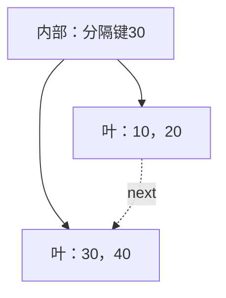

## 先声明我们实现的究竟是什么

本讲接续[第六讲的B+树手推](/notes/data-structures/06-search-trees-and-hashing)，不是将[第十一讲的B树](/notes/data-structures/11-b-tree-insertion-deletion)换个名字。我们实现**不重复整数键的有序集合**，不存附加业务值，不涉及磁盘页、并发事务或崩溃恢复。整数只是一条记录的简化形式。

约定如下，答题和写代码时都不能省略：

| 对象 | 稳定状态的容量 | 保存的内容 |
| --- | --- | --- |
| 非根叶子 | 2–3条记录 | 按严格递增顺序存键，next指向下一叶 |
| 内部非根结点 | 2–4个孩子 | k个孩子配k−1个分隔键 |
| 内部根 | 2–4个孩子 | 和内部结点相同，但只剩1个孩子时要收缩 |
| 根就是叶子 | 0–3条记录 | 允许用空叶表示空树 |

所有叶子深度相同。**内部结点的第i个分隔键，等于第i+1个孩子子树的最小记录键**（本句按人习惯从1计数）；代码从0计数，即`key[i-1] = minimum(child[i])`，i从1开始。内部结点的键只是导航副本，不是另一条集合记录。

因此查找x时，若x等于分隔键，走右边。例：分隔键为30、50，三个孩子负责x<30、30≤x<50、x≥50。内部结点有30并不代表可提前返回；必须到叶子检查记录是否存在。

## 分裂：叶子复制导航信息，内部重新分配孩子

向叶[10,20,30]插入40会临时得到4条记录。分成[10,20]和[30,40]，父结点保存30。**30仍然在右叶**。



叶链必须按这个顺序更新：新右叶的next取原叶next，原叶next改为新右叶。否则范围扫描可能跳过新叶，或丢失后面的整段链。

内部结点的溢出则是**5个孩子**。分为左边2个、右边3个孩子，各自根据孩子重算分隔键。例：五棵孩子子树的最小键为10、30、50、70、90，那么原临时分隔键是30、50、70、90。分裂后：

| 位置 | 孩子子树最小键 | 本结点的分隔键 |
| --- | --- | --- |
| 左内部结点 | 10，30 | 30 |
| 右内部结点 | 50，70，90 | 70，90 |
| 新父亲 | 左子树最小10，右子树最小50 | 50 |

50不再是左右内部结点中的分隔键，却仍然是一片后代叶子里的记录。不要把“从这一层索引移走”理解为“从集合删除”。只有根分裂才增加整棵树的高度。

## 删除：先删记录，再沿返回路径修复

非根叶最少2条记录。删到1条时，向同一父亲下的相邻兄弟借；兄弟有3条才能借，因为借出以后它自己也必须至少2条。借不到就合并：1+2=3，不超过叶容量。

内部孩子数从2减到1时同理。兄弟有至少3个孩子才能借一个；否则1+2=3合并。**内部借的是整棵孩子子树的指针**，不是把一个整数键挪过去就结束。叶子合并要修next；内部合并不要拼接next，因为内部结点不在叶链上。

### 没有下溢，也可能必须改祖先

若叶[30,40,45]删掉30，仍剩2条，不需要借并。但它的最小键变为40，指向它的分隔键也必须变为40。如果该叶在某内部结点的最左分支中，这个内部结点自己的最小值也变了；它又可能是更高祖先的右侧孩子。于是变化需要沿返回路径传播。

本实现选择易审查的方式：递归返回到每个内部结点时，根据孩子重新计算全部分隔键。这样无需猜测本次是否影响祖先，但有额外代价，复杂度会在后面如实计算。

### 把“删除30”慢放

从根[30,50]和叶[10,20]、[30,40]、[50,60]开始：

1. 比较30与第一个分隔键，相等走中叶。
2. 删除记录30，中叶变[40]，发生下溢。
3. 左叶只有2条，不能借；右叶也只有2条，不能借。
4. 将中叶并入左叶，得到[10,20,40]；左叶next跳到[50,60]。
5. 父亲移除中叶指针，剩两个孩子；分隔键由右孩子最小值重算为50。

若接着删10，左叶[20,40]仍合法，根仍是50。再删20，左叶[40]下溢，右叶只有2条，只能合并成[40,50,60]。根只剩一个孩子，释放旧根，让这片叶成为新根。此时高度才减少。

## 完整C程序的对象和接口

`Node.n`有两种含义：叶子中是记录数，内部中是孩子数。用同一个字段是为了简化移动循环，不是说两种数量相等。数组预留溢出槽：叶4键，内部5孩子；稳定状态不能因此把容量说成4记录/5孩子。

程序采用256槽可回收结点池、最多64条记录。非空稳定树的叶数不大于记录数，内部结点数不超过叶数减1，临时分裂需要的少量额外槽也远小于256。本例不处理malloc失败，而是在接口先拒绝第65个新键；池耗尽断言代表实现不变量有错，不是普通的“集合已满”。Tree含指向自身pool的指针，初始化以后**不能按值复制或移动Tree对象**。

insert返回1表示新增、0表示已存在、-1表示容量已满。erase返回是否真的删除。range返回闭区间[lo,hi]中的记录数并按序写入out；调用者必须提供至少64个int的数组。三个接口都要求有效、已初始化的Tree指针。

```c
#include <assert.h>
#include <stdbool.h>
#include <stdint.h>
#include <stdio.h>
#include <limits.h>

enum { POOL = 256, LIMIT = 64 };
typedef struct Node {
    bool used, leaf;
    int n, key[4];
    struct Node *child[5], *next;
} Node;
typedef struct {
    Node pool[POOL], *root;
    int size;
    unsigned split_leaf, split_inner, borrow_left, borrow_right, merges, shrinks;
    unsigned repairs[2][3]; /* internal/leaf x left borrow/right borrow/merge */
} Tree;
static Node *new_node(Tree *t, bool leaf) {
    for (int i = 0; i < POOL; ++i) if (!t->pool[i].used) {
        t->pool[i] = (Node){0};
        t->pool[i].used = true; t->pool[i].leaf = leaf;
        return &t->pool[i];
    }
    assert(false); return NULL;
}
static void init(Tree *t) { *t = (Tree){0}; t->root = new_node(t, true); }
static int minimum(const Node *p) {
    while (!p->leaf) p = p->child[0];
    assert(p->n > 0); return p->key[0];
}
static void refresh(Node *p) {
    if (!p->leaf)
        for (int i = 1; i < p->n; ++i) p->key[i-1] = minimum(p->child[i]);
}
static int route(const Node *p, int x) {
    int i = 0;
    while (i + 1 < p->n && x >= p->key[i]) ++i;
    return i;
}
static bool contains(const Tree *t, int x) {
    const Node *p = t->root;
    while (!p->leaf) p = p->child[route(p, x)];
    for (int i = 0; i < p->n; ++i) if (p->key[i] == x) return true;
    return false;
}
/* Return the new right sibling, or NULL if this node did not split. */
static Node *insert_rec(Tree *t, Node *p, int x) {
    if (p->leaf) {
        int i = p->n;
        while (i > 0 && p->key[i-1] > x) { p->key[i] = p->key[i-1]; --i; }
        p->key[i] = x; ++p->n;
        if (p->n <= 3) return NULL;
        Node *right = new_node(t, true);
        right->n = 2; right->key[0] = p->key[2]; right->key[1] = p->key[3];
        p->n = 2; right->next = p->next; p->next = right;
        ++t->split_leaf; return right;
    }
    int i = route(p, x);
    Node *right = insert_rec(t, p->child[i], x);
    if (right) {
        for (int j = p->n; j > i+1; --j) p->child[j] = p->child[j-1];
        p->child[i+1] = right; ++p->n;
    }
    if (p->n <= 4) { refresh(p); return NULL; }
    right = new_node(t, false); right->n = 3;
    for (int j = 0; j < 3; ++j) right->child[j] = p->child[j+2];
    p->n = 2; refresh(p); refresh(right); ++t->split_inner;
    return right;
}
static int insert(Tree *t, int x) {
    if (contains(t, x)) return 0;
    if (t->size == LIMIT) return -1;
    Node *right = insert_rec(t, t->root, x);
    if (right) {
        Node *root = new_node(t, false); root->n = 2;
        root->child[0] = t->root; root->child[1] = right;
        refresh(root); t->root = root;
    }
    ++t->size; return 1;
}
/* Repair child[i], which has exactly one record/child. */
static void repair(Tree *t, Node *parent, int i) {
    Node *p = parent->child[i];
    Node *left = i > 0 ? parent->child[i-1] : NULL;
    Node *right = i+1 < parent->n ? parent->child[i+1] : NULL;
    if (left && left->n > 2) {
        for (int j = p->n; j > 0; --j) {
            if (p->leaf) p->key[j] = p->key[j-1];
            else p->child[j] = p->child[j-1];
        }
        if (p->leaf) p->key[0] = left->key[left->n-1];
        else p->child[0] = left->child[left->n-1];
        --left->n; ++p->n; refresh(left); refresh(p); ++t->borrow_left;
        ++t->repairs[p->leaf][0];
    } else if (right && right->n > 2) {
        if (p->leaf) p->key[p->n] = right->key[0];
        else p->child[p->n] = right->child[0];
        ++p->n;
        for (int j = 1; j < right->n; ++j) {
            if (p->leaf) right->key[j-1] = right->key[j];
            else right->child[j-1] = right->child[j];
        }
        --right->n; refresh(right); refresh(p); ++t->borrow_right;
        ++t->repairs[p->leaf][1];
    } else {
        /* Always merge the right node into its left neighbour. */
        int remove = left ? i : i+1;
        Node *a = left ? left : p, *b = left ? p : right;
        assert(b && a->leaf == b->leaf);
        for (int j = 0; j < b->n; ++j) {
            if (a->leaf) a->key[a->n+j] = b->key[j];
            else a->child[a->n+j] = b->child[j];
        }
        a->n += b->n;
        if (a->leaf) a->next = b->next;
        b->used = false; refresh(a);
        for (int j = remove+1; j < parent->n; ++j)
            parent->child[j-1] = parent->child[j];
        --parent->n; ++t->merges; ++t->repairs[a->leaf][2];
    }
    refresh(parent);
}
static bool erase_rec(Tree *t, Node *p, int x) {
    if (p->leaf) {
        int i = 0;
        while (i < p->n && p->key[i] != x) ++i;
        if (i == p->n) return false;
        for (int j = i+1; j < p->n; ++j) p->key[j-1] = p->key[j];
        --p->n; return true;
    }
    int i = route(p, x);
    if (!erase_rec(t, p->child[i], x)) return false;
    if (p->child[i]->n < 2) repair(t, p, i);
    refresh(p); return true;
}
static bool erase(Tree *t, int x) {
    if (!erase_rec(t, t->root, x)) return false;
    --t->size;
    if (!t->root->leaf && t->root->n == 1) {
        Node *old = t->root; t->root = old->child[0]; old->used = false;
        ++t->shrinks;
    }
    return true;
}
static int range(const Tree *t, int lo, int hi, int out[LIMIT]) {
    if (lo > hi) return 0;
    const Node *p = t->root; int count = 0;
    while (!p->leaf) p = p->child[route(p, lo)];
    for (; p; p = p->next) for (int i = 0; i < p->n; ++i) {
        if (p->key[i] > hi) return count;
        if (p->key[i] >= lo) out[count++] = p->key[i];
    }
    return count;
}
typedef struct { int min, max, count, depth; } Summary;
static Summary audit(const Tree *t, const Node *p, bool root, bool seen[POOL],
                     const Node **previous) {
    int id = (int)(p - t->pool);
    assert(id >= 0 && id < POOL && p->used && !seen[id]); seen[id] = true;
    if (p->leaf) {
        assert(p->n >= (root ? 0 : 2) && p->n <= 3);
        for (int i = 1; i < p->n; ++i) assert(p->key[i-1] < p->key[i]);
        if (*previous) assert((*previous)->next == p);
        *previous = p;
        return (Summary){p->n ? p->key[0] : 0,
                         p->n ? p->key[p->n-1] : 0, p->n, 0};
    }
    assert(p->n >= 2 && p->n <= 4);
    Summary result = audit(t, p->child[0], false, seen, previous);
    for (int i = 1; i < p->n; ++i) {
        Summary next = audit(t, p->child[i], false, seen, previous);
        assert(result.max < next.min && p->key[i-1] == next.min);
        assert(result.depth == next.depth);
        result.max = next.max; result.count += next.count;
    }
    ++result.depth; return result;
}
static void check(const Tree *t, const bool model[LIMIT]) {
    bool seen[POOL] = {false}; const Node *previous = NULL;
    Summary s = audit(t, t->root, true, seen, &previous);
    assert(previous && !previous->next && s.count == t->size);
    for (int i = 0; i < POOL; ++i) assert(seen[i] == t->pool[i].used);
    int out[LIMIT], count = range(t, INT_MIN, INT_MAX, out), k = 0;
    for (int x = 0; x < LIMIT; ++x) {
        assert(contains(t, x) == model[x]);
        if (model[x]) { assert(k < count && out[k] == x); ++k; }
    }
    assert(k == count && count == t->size);
    int narrow[LIMIT], m = range(t, 17, 42, narrow), j = 0;
    for (int i = 0; i < count; ++i) if (out[i] >= 17 && out[i] <= 42) {
        assert(j < m && narrow[j] == out[i]); ++j;
    }
    assert(j == m && range(t, 9, 3, narrow) == 0);
}
int main(void) {
    Tree t; init(&t); bool model[LIMIT] = {false};
    const int demo[] = {10,20,30,40,50,60}; int out[LIMIT];
    for (int i = 0; i < 6; ++i) { assert(insert(&t, demo[i]) == 1); model[demo[i]] = true; check(&t, model); }
    int n = range(&t, 25, 55, out);
    printf("range [25,55]:"); for (int i = 0; i < n; ++i) printf(" %d", out[i]); puts("");
    assert(erase(&t, 30)); model[30] = false; check(&t, model);
    n = range(&t, INT_MIN, INT_MAX, out);
    printf("after erase 30:"); for (int i = 0; i < n; ++i) printf(" %d", out[i]); puts("");
    for (int i = 0; i < LIMIT; ++i) { insert(&t, i); model[i] = true; check(&t, model); }
    assert(insert(&t, 99) == -1 && insert(&t, 0) == 0);
    for (int i = 0; i < LIMIT; ++i) { assert(erase(&t, i)); model[i] = false; check(&t, model); }
    uint32_t state = 7;
    for (int step = 0; step < 30000; ++step) {
        state = state * UINT32_C(1664525) + UINT32_C(1013904223);
        int x = (int)((state >> 8) % LIMIT);
        if (state & UINT32_C(0x80000000)) {
            assert(insert(&t, x) == (model[x] ? 0 : 1)); model[x] = true;
        } else { assert(erase(&t, x) == model[x]); model[x] = false; }
        check(&t, model);
    }
    assert(t.split_leaf && t.split_inner && t.borrow_left && t.borrow_right && t.merges && t.shrinks);
    for (int kind = 0; kind < 2; ++kind)
        for (int action = 0; action < 3; ++action) assert(t.repairs[kind][action] > 0);
    puts("30000 model operations: occupancy, separators, depth, leaf chain and ranges passed");
    init(&t);
    assert(insert(&t, INT_MIN) == 1 && insert(&t, INT_MAX) == 1);
    assert(range(&t, INT_MIN, INT_MAX, out) == 2 && out[0] == INT_MIN && out[1] == INT_MAX);
    assert(erase(&t, INT_MIN) && erase(&t, INT_MAX) && !erase(&t, 0));
    puts("extreme keys, full capacity, duplicate and empty-tree checks passed");
    return 0;
}
```

<!-- study-run:BEGIN sha256=f7912c6b180d72007a9d1e8c412f0d579b9ac2b97d9bf6582f6f16cd2320ea4a -->
本段代码的实测输出（GCC，C17；不代表所有输入）：

```text
range [25,55]: 30 40 50
after erase 30: 10 20 40 50 60
30000 model operations: occupancy, separators, depth, leaf chain and ranges passed
extreme keys, full capacity, duplicate and empty-tree checks passed
```
<!-- study-run:END -->

## 读代码时不要跳过的四个接口

### insert_rec返回的是右兄弟，不是新的整棵树

原结点p保留下来作为左半边，函数返回新右半边，父亲把它插在原孩子后。NULL表示没有分裂。顶层若拿到非NULL，就创建新根，两个孩子正是旧根和新右兄弟。这里的返回值协议和BST“返回新根”不同，必须按函数约定理解，不能见到Node指针就套同一种含义。

### repair为什么借孩子后要refresh两边

借来的子树可能改变接收者最小值，借出者也可能失去最小子树。两边的分隔键都需要恢复，父亲还要重新反映它们的最小值。代码用refresh统一处理。数组有效区是[0,n)，旧位置里残留的指针不表示还拥有另一份子树，遍历绝不能超过n。

### 删除内部结点分隔键不是删除记录

erase_rec永远先下降到叶子；命中内部key也继续走右侧。只有叶子真正移除集合成员。随后内部的key由refresh生成，不能额外对“同值的父键”做一次集合删除，否则会把导航结构和记录计数混为一谈。

### audit检查的是结构，model检查的是集合语义

只验证最终输出有序，发现不了叶子深度不等、next跳过叶子或池槽泄漏；只验证结构，发现不了合法但丢了某条记录的树。所以每次随机操作都同时核对占用率、祖先区间、精确分隔键、叶层齐平、叶链顺序、池可达性、全集与范围结果。固定随机种子可复现，但三万次测试仍不是形式证明。audit的指针减法要求指针来自本池，它不是验证任意损坏内存的安全扫描器。

## 正确性与复杂度分开证明

一次插入只改变一个叶子以及到根的路径。叶子分裂保留全部记录且按序二分；内部分裂只是重新分组孩子，不改叶子记录。每次分裂均保持同层孩子深度相同，新根给所有路径同时增加一层。删除的借并也只发生在同父兄弟之间，不打乱区间顺序；叶链在合并时跳过被回收叶，内部操作不改叶层顺序。沿返回路径重算分隔键恢复导航不变量。根收缩对所有叶子同时减少一层。

令高度为h。本程序查找每层最多比较3次，时间O(h)。一般非空树的h为O(log(n+1))，空树另作常数处理。**更新不是这里就能写O(h)**：refresh需要沿孩子的最左分支求minimum；沿路径累加最坏为1+2+…+h=O(h²)。固定容量下这是可接受的教学简化。如果给每个结点缓存子树最小值并正确更新，才可将每次refresh降为常数，进一步获得O(h)更新。

输出z条记录的范围查询为O(h+z+1)：先下降一次，然后顺着叶链前进，末尾最多多检查一个边界叶。验证器与三万次测试不计入单次接口的复杂度；池分配还扫描固定256槽，在本程序是固定上界，若将池容量参数化则应单独计入，不能说可扩展版本也免费。

## 自编练习与答案方向

1. 叶[30,40,45]删除30没有下溢，父分隔键能否继续保持30？本讲不行，因为定义要求精确最小值40；某些不同约定允许松弛边界，但不能混用。
2. 为什么3记录叶和4孩子内部结点都采用最小2？这是本讲的两条独立容量约定，不是统一套“阶减一”；分别检查溢出4分成2+2、溢出5分成2+3，借并后容量仍合法。
3. 范围扫描中，内部比较命中50，能否马上输出50？不能，内部是导航副本，必须到叶验证记录，再扫描。
4. 如果删除最后一条记录，root必须变NULL吗？本实现保留空根叶，size为0、next为NULL，同样能表达空集合；不要混入别的实现的空树约定。
5. 如何减少refresh成本？缓存每棵子树的最小键，并说明插入、删除、借并后从下到上的更新顺序；只加一个字段而不维护它反而引入新的错误。

本章为自行编写的教学实现与例题，不是视频原题或生产数据库索引。B+树的一般机制可参考第六讲已有资料链接；涉及教材“阶”的题目，应先转成具体孩子数、记录数和分隔键语义，再使用这里的推理。
