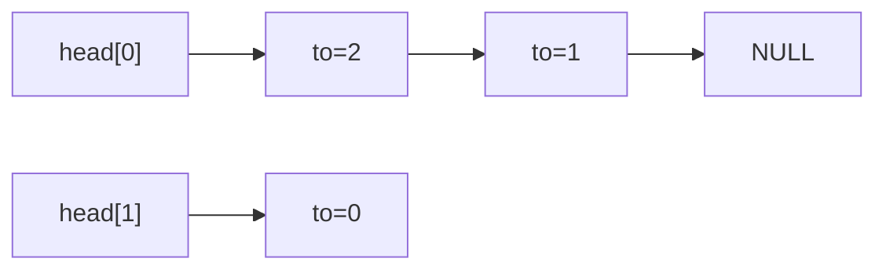

## 矩阵之外，真正分配一张图

第四讲的图算法使用邻接矩阵。本讲实现无向简单图：无自环、无平行边，顶点编号0到n−1，n≤8。邻接表不是“把顶点串成一条链”，而是每个顶点拥有一条**出发到邻居的表项链**。无向边{u,v}用两个表项u→v、v→u表示，统计逻辑边数时只能加一次。



head[0]保存第一个表项的地址，表项的to保存邻居编号，next保存同一条链的下一表项地址。`to=2`不是指针，也不表示“第三个表项”。head数组和各表项的职责要分开。

## 先理解失败再写成功路径

### 编号与地址先分开看

这个小例子用两个局部表项组成链，完全不申请堆内存，因此不应free它们。它只是展示字段含义；后面的完整图使用malloc分配，拥有不同的释放责任。

```c
#include <assert.h>
#include <stdio.h>
typedef struct Arc { int to; struct Arc *next; } Arc;
int main(void) {
    Arc second={1,NULL},first={2,&second};
    Arc *head=&first; int count=0;
    for(const Arc *p=head;p;p=p->next) { printf("neighbour=%d\n",p->to); ++count; }
    assert(head->to==2 && head->next->to==1 && count==2);
    return 0;
}
```

<!-- study-run:BEGIN sha256=d40784766c9cc471cb27ec1a92c6b921cd6b915be6c964789e5edeb06277378c -->
本段代码的实测输出（GCC，C17；不代表所有输入）：

```text
neighbour=2
neighbour=1
```
<!-- study-run:END -->

添加无向边需要分配两个表项。如果第一个成功、第二个失败，不能留下一条单向边。正确顺序是先拿到两个对象，再同时挂入两条链；第二次失败时释放第一次分配的对象。删除或释放链时先保存next，free以后不能再读当前结点字段。

下面的分配器支持“第几次失败”注入。它只模拟失败，不替代操作系统，也不证明所有硬件故障都已覆盖。live计数用于核对本程序是否归还了自己申请的表项。

```c
#include <assert.h>
#include <stdbool.h>
#include <stdio.h>
#include <stdlib.h>
enum { MAXV=8 };
typedef struct Arc { int to; struct Arc *next; } Arc;
typedef struct { int n, edges; Arc *head[MAXV]; } Graph;
static int fail_after=-1, live;
static Arc *allocate(void) {
    if(fail_after==0) return NULL;
    if(fail_after>0) --fail_after;
    Arc *p=malloc(sizeof *p); if(p) ++live; return p;
}
static void release(Arc *p) { if(p) { --live; free(p); } }
static bool init(Graph *g,int n) {
    if(!g || n<0 || n>MAXV) return false;
    *g=(Graph){0}; g->n=n; return true;
}
static bool has(const Graph *g,int u,int v) {
    for(const Arc *p=g->head[u];p;p=p->next) if(p->to==v) return true;
    return false;
}
/* 1 added, 0 duplicate, -1 invalid, -2 allocation failure */
static int add(Graph *g,int u,int v) {
    if(u<0 || v<0 || u>=g->n || v>=g->n || u==v) return -1;
    if(has(g,u,v)) return 0;
    Arc *a=allocate(); if(!a) return -2;
    Arc *b=allocate(); if(!b) { release(a); return -2; }
    *a=(Arc){v,g->head[u]}; *b=(Arc){u,g->head[v]};
    g->head[u]=a; g->head[v]=b; ++g->edges; return 1;
}
static void clear(Graph *g) {
    for(int i=0;i<g->n;++i) {
        Arc *p=g->head[i];
        while(p) { Arc *next=p->next; release(p); p=next; }
        g->head[i]=NULL;
    }
    g->edges=0;
}
static bool bfs(const Graph *g,int start,int distance[MAXV]) {
    if(start<0 || start>=g->n) return false;
    for(int i=0;i<g->n;++i) distance[i]=-1;
    int queue[MAXV],front=0,back=0; queue[back++]=start; distance[start]=0;
    while(front<back) {
        int u=queue[front++];
        for(const Arc *p=g->head[u];p;p=p->next) if(distance[p->to]<0) {
            distance[p->to]=distance[u]+1; queue[back++]=p->to;
        }
    }
    return true;
}
static void audit(const Graph *g) {
    int arcs=0;
    for(int u=0;u<g->n;++u) {
        bool seen[MAXV]={false};
        for(const Arc *p=g->head[u];p;p=p->next) {
            assert(p->to>=0 && p->to<g->n && p->to!=u && !seen[p->to]);
            seen[p->to]=true; assert(has(g,p->to,u)); ++arcs;
        }
    }
    assert(arcs==2*g->edges);
}
int main(void) {
    Graph g; assert(init(&g,5));
    fail_after=0; assert(add(&g,0,1)==-2 && live==0);
    fail_after=1; assert(add(&g,0,1)==-2 && live==0 && g.edges==0); audit(&g);
    fail_after=-1;
    assert(add(&g,0,1)==1 && add(&g,0,2)==1 && add(&g,2,3)==1);
    assert(add(&g,1,0)==0 && add(&g,0,0)==-1 && add(&g,0,5)==-1); audit(&g);
    int d[MAXV]; assert(bfs(&g,0,d));
    for(int i=0;i<g.n;++i) printf("vertex=%d distance=%d\n",i,d[i]);
    assert(d[0]==0 && d[1]==1 && d[2]==1 && d[3]==2 && d[4]==-1);
    clear(&g); clear(&g); assert(live==0); audit(&g);
    /* Enumerate every undirected simple graph on four vertices. */
    for(unsigned mask=0;mask<64;++mask) {
        assert(init(&g,4)); int bit=0;
        for(int u=0;u<4;++u) for(int v=u+1;v<4;++v,++bit)
            if(mask&(1u<<bit)) assert(add(&g,u,v)==1);
        audit(&g);
        int matrix[4][4];
        for(int u=0;u<4;++u) for(int v=0;v<4;++v)
            matrix[u][v]=u==v?0:(has(&g,u,v)?1:99);
        for(int k=0;k<4;++k) for(int u=0;u<4;++u) for(int v=0;v<4;++v)
            if(matrix[u][k]+matrix[k][v]<matrix[u][v]) matrix[u][v]=matrix[u][k]+matrix[k][v];
        for(int s=0;s<4;++s) {
            assert(bfs(&g,s,d));
            for(int v=0;v<4;++v) assert(d[v]==(matrix[s][v]==99?-1:matrix[s][v]));
        }
        clear(&g); assert(live==0);
    }
    assert(init(&g,0) && !bfs(&g,0,d)); clear(&g);
    puts("64 graphs x 4 sources; allocation rollback and release checks passed");
    return 0;
}
```

<!-- study-run:BEGIN sha256=d759830655a036560350720e5782908b805881a4047098bb9e09130a7a266da4 -->
本段代码的实测输出（GCC，C17；不代表所有输入）：

```text
vertex=0 distance=0
vertex=1 distance=1
vertex=2 distance=1
vertex=3 distance=2
vertex=4 distance=-1
64 graphs x 4 sources; allocation rollback and release checks passed
```
<!-- study-run:END -->

## 队列为什么不会越界

入队时立刻把distance从-1改为非负。其他边再到达这个顶点时不会第二次入队，所以队列最多存n个编号。若等到出队才标记，同一层的多个前驱可能反复加入同一顶点，长度n的数组便不再安全。

从0出发，先标0的距离为0；扫描它的邻居1、2，距离都是1；轮到2时发现3，得到2；顶点4没有路径，保留-1。头插法使邻居访问顺序可能与输入顺序相反，但无权最短距离不变。BFS用于无权最少边数，不用于一般带权最短路。

构造时为拒绝重边要扫描一条邻接链，每条新增边不保证O(1)。遍历与释放为O(V+E)，空间也是O(V+E)；无向图实际分配2E表项，这个常数不能在内存计数题里忽略。clear保留顶点数，清除所有边，可再次添加；init只能用于新对象或已经clear的对象，否则会覆盖旧指针造成泄漏。Graph也不能浅复制后对两份都clear。

本讲选择完整实现一种最常用的存储。逆邻接表、十字链表仍可用第四讲定义对照理解，不把“完成邻接表”扩大为所有表示都有实现。
