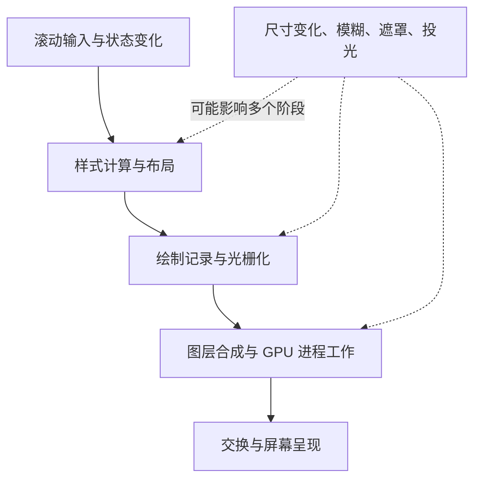
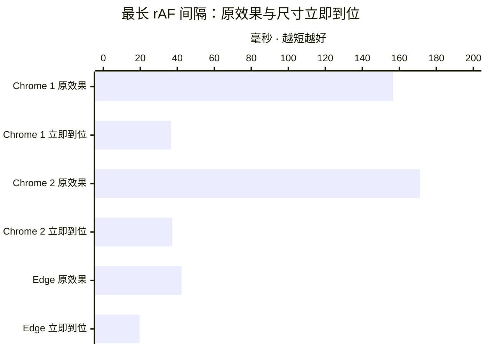
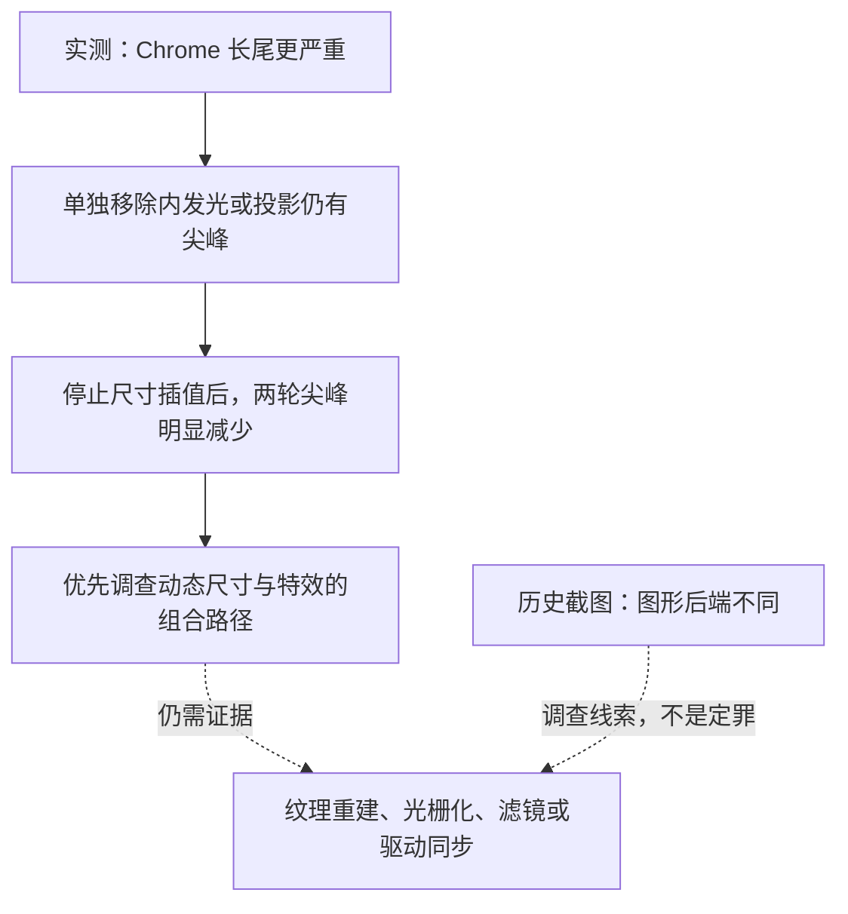

这是一篇由 AI 根据 Inkroam 的实际测试记录整理的技术报告。问题由博客作者反复体验、反馈，并提供浏览器信息和性能录制；本文的数据来自这些记录及随后进行的本机隔离实验，不是模拟跑分。

先给结论：**在这台电脑、这组页面效果和测试条件下，Chrome 确实比 Edge 更容易出现明显的长卡顿。最值得继续追查的触发条件，是导航栏连续改变尺寸与层次特效的组合，而不是某一个发光图层独自“有罪”。**

Chrome 两轮开启鲜明层次时，最长 `requestAnimationFrame` 回调间隔分别为 **156.6ms、171.3ms**；Edge 同一 CSS 页面尺寸下为 **42.4ms**。保留光效，只让导航宽度立即到位，Chrome 两轮降至 **36.7ms、37.3ms**。

但这还不是“Dawn 有 bug”的结案报告，也不是让我们删掉动画的理由。它是一份记录到 2026 年 10 月 7 日的调查：已经知道什么、怎样知道，以及还不能说什么。

## 一、事情从一条会变宽的导航栏开始

Inkroam 的导航在页面顶部较窄，滚动后展开到接近视口宽度。过渡不是瞬间跳变，而是持续约 440ms 的非线性尺寸动画。

开启“层次感”后，它还会参与一组视觉关系：玻璃表面的轻微自发光、文字与图标的投光、分别落在内容卡片和背景上的近远投影，以及内容卡片自身的阴影。深色模式尤其容易观察到光的变化。

这些效果并不是为了做一块孤立的发光牌子，而是让导航、内容、背景看起来处在不同高度。

问题也非常具体：**关闭层次感时，导航展宽比较顺；开启之后，Chrome 中就会卡。** 试过调整亮度时序、把亮度变化延后到尺寸变化之后，也试过把内发光拆成固定尺寸的两端与中间条带，用户仍然能察觉卡顿。

随后出现了一个很有价值的反例：同一台电脑上，Edge 的体验明显更好。

当前滚动后亮度滞后变化，是排查过程中暂留的中间实验设计，不是性能问题解决后的最终动效；不能把它当作已经确定的设计规范。本文实验完成后，作者还发现分片内发光在 Logo 旁出现竖向接缝，因此已恢复连续的内发光表面，保留原光学参数。下文数据描述的是修复接缝前的被测版本，不代表该修复后的新测量。

这迫使调查从“再调一点阴影参数”转向一个更严肃的问题：到底是哪一段渲染工作被放大了？

## 二、先弄清楚：我们说的“卡”是哪一种时间

网页不是 JavaScript 执行完就自动出现在屏幕上。下面是一个概念图，不表示线程严格串行，也不表示每帧一定完整重做所有阶段。



这里至少要区分三个量：

| 指标 | 实际含义 | 不能直接当成什么 |
| --- | --- | --- |
| rAF 回调间隔 | 连续两次动画帧回调时间戳的差 | 实际屏幕呈现帧率、单个 GPU 任务耗时 |
| GPU 进程任务跨度 | GPU 进程某项任务的墙钟时间，可能包括等待 | 着色器实际执行时间、显卡算力测试 |
| 提交到呈现延迟 | 一帧从提交合成到呈现之间的时间 | 同一个时刻主线程阻塞了多久 |

P95 是把样本从小到大排列后，靠近第 95 百分位的值。本轮 rAF 汇总取排序数组下标 `floor((n - 1) × 0.95)`，不做插值。最大值则只描述采样中最慢的一次，容易受偶发因素影响，所以不能只挑最大值写标题、把其余数据藏起来。

同样，不能把 `1000 / 最大间隔` 叫作整段动画的 FPS。一个尖峰不是整段时间都停留在那个帧率。

## 三、两份 Chrome 录制，把方向指向了绘制之后

10 月 6 日，作者提供了两份 DevTools 性能记录，并确认对应关系：

- `Trace-20261006T230836.json.gz`：开启层次感。
- `Trace-20261006T230916.json.gz`：关闭层次感。

我们按渲染进程、事件名称和事件 ID 配对异步阶段，将首个滚动或滚轮事件到末个事件后一秒定义为交互窗口，统计在该窗口内开始、且能在完整录制中配对到结束事件的相关阶段。两份交互窗口约为 2.176 秒和 1.866 秒，因此不是严格等长、等输入的基准实验。

| 录制指标 | 开启层次 | 关闭层次 |
| --- | ---: | ---: |
| 提交合成帧到呈现：中位数 | 74.62ms | 65.60ms |
| 提交合成帧到呈现：P95 | 269.37ms | 73.88ms |
| 提交合成帧到呈现：最大值 | 298.83ms | 78.73ms |
| StartDraw 到 SwapStart：P95 | 193.45ms | 35.52ms |
| Swap 结束到呈现：P95 | 5.93ms | 7.30ms |
| 全录制 GPU 主线程 RunTask 最大跨度 | 207.741ms | 38.537ms |

这里最后一行使用全录制范围，其余行使用上面定义的交互窗口；不能把它们当作同一批事件相加。异步阶段本身也可能重叠。

最醒目的差异，出现在绘制到交换之前及 GPU 进程任务的长尾。开启记录里还有一项约 192.441ms 的 GPU 进程任务。

但 trace 没有给出这些长任务内部足够细的分解。究竟是滤镜、资源分配、上传、驱动同步，还是几种成本叠加，目前还无法拆开。

### 主线程确实有问题，但不是那个 200ms 问题

记录里两次 `DepthReceivers.onScroll` 耗时约 9.930ms、8.156ms，内部的 `UpdateLayoutTree` 分别约 9.604ms、7.700ms。栈指向 `pageScrollTop → onScroll`：读滚动位置时，触发了同步样式更新。

其中嵌套的 `Layout` 只有约 0.148ms、0.235ms，所以这里的大头是样式更新，不是几何布局本身。

随后做了一项不改变视觉的修复：滚动回调只安排任务，把位置读取合并到动画帧；内部滚动没有改变页面位置时，跳过接收面几何更新。相关行为测试与项目 32 项检查套件通过。

**这说明调度逻辑得到验证，不说明 GPU 卡顿已经消失。** rAF 中读取几何仍可能刷新样式；把读取挪个位置，也不等于所有布局成本凭空消失。

还有一个容易误判的细节：两份记录中，渲染主线程唯一超过 50ms 的 `RunTask` 主要来自 `CpuProfiler::StartProfiling`。那是启动采样器的开销，不应该算到博客业务逻辑头上。

## 四、差点把测试条件当成浏览器差异

10 月 7 日开始浏览器对照时，Chrome 的初始 CSS 视口宽 1707px，Edge 却只有 767px。

这不是小误差：Inkroam 在 768px 及以上才应用桌面导航展宽规则。767px 的 Edge 已落入移动断点，根本没有承受同样的尺寸动画。

因此我们先统一到 **1707×876 CSS px**，再比较。

第二个坑更隐蔽：第一轮 Chrome 所有组都出现约 1000ms 的回调间隔，连关闭层次感也一样。它看起来像浏览器灾难，实际上这轮数据受到疑似窗口遮挡或后台节流干扰。`visibilityState` 还报告为 `visible`，所以单看这个字段并不够。

这轮全部作废。作者将测试窗口放到前台并保持可见后，重新运行才获得下面的数据。

### 正式采样条件

| 条件 | Chrome 第一轮 | Chrome 第二轮 | Edge |
| --- | --- | --- | --- |
| CSS 视口 | 1707×876 | 1707×876 | 1707×876 |
| 页面报告 DPR | 1.5 | 约 1.0 | 约 1.1 |
| 外观 | 深色 | 深色 | 深色 |
| 导航材质与模糊 | 液态玻璃、14px | 同左 | 同左 |
| 内容模糊 | 5px | 5px | 5px |
| 背景 | 同一自定义背景 | 同左 | 同左 |

背景 CSS 变量内容做过一致性校验。两款浏览器顺序测试，没有同时运行采样来争用 GPU。

每组先静置 1300ms，再进行两次 `0 → 100 → 0px` 滚动往返；每个方向记录约 1150ms 的 rAF 间隔，共四段。每组只改变表中指定的条件，测试后恢复原来的层次设置和滚动位置，不写入持久偏好。

Chrome 第二轮使用浏览器测试接口覆盖设备指标。**报告 DPR 降低不等于我们已经验证内部所有纹理分辨率都随之降低**，也不等于换了一台低分辨率显示器。

## 五、可视化：最有区分度的干预不是关灯，而是停止连续改尺寸

下图对比“鲜明层次原效果”和“保留光效、取消导航尺寸过渡”两组的最长 rAF 间隔。横轴从零开始，单位为毫秒，越短越好。它是有限采样的最大值对照，不是平均帧率排行榜。



图中六个值依次为 **156.6、36.7、171.3、37.3、42.4、19.6ms**。Chrome 1/2 的 DPR 分别为 1.5/约1.0，Edge 约1.1；这不是三个完全同条件的独立重复实验。

### Chrome 第一轮：原始 DPR 1.5

表中 N 是四段采样合并后的回调间隔样本数，不是独立实验次数；采样时长近似相同，卡顿会改变回调数量。

| 测试组 | N | 中位数 ms | P95 ms | 最大 ms | 超过50ms次数 |
| --- | ---: | ---: | ---: | ---: | ---: |
| 层次关闭 | 471 | 6.1 | 27.5 | 60.8 | 1 |
| 鲜明层次原效果 | 265 | 7.2 | 36.4 | 156.6 | 9 |
| 隐藏 SVG 投影 | 272 | 8.0 | 34.1 | 158.5 | 5 |
| 隐藏内发光 | 252 | 9.0 | 36.6 | 167.1 | 7 |
| 去掉导航背景滤镜 | 260 | 7.8 | 37.2 | 173.5 | 7 |
| 去掉内容背景滤镜 | 331 | 12.0 | 24.4 | 151.3 | 6 |
| 去掉文字与图标投光 | 260 | 8.3 | 42.4 | 176.4 | 7 |
| 保留光效，尺寸立即到位 | 500 | 6.1 | 24.7 | 36.7 | 0 |

单独去掉内发光，没有消除长尖峰。单独去掉 SVG 投影，也没有。去掉导航自身的 `backdrop-filter`，仍然没有。

去掉内容背景滤镜改善了 P95，但最大值仍有 151.3ms。这提示我们：**持续的绘制成本与偶发长尖峰，可能不是同一个问题。**

### Chrome 第二轮：报告 DPR 约1.0

| 测试组 | N | 中位数 ms | P95 ms | 最大 ms | 超过50ms次数 |
| --- | ---: | ---: | ---: | ---: | ---: |
| 层次关闭 | 461 | 6.1 | 30.3 | 58.8 | 4 |
| 鲜明层次原效果 | 238 | 8.8 | 42.5 | 171.3 | 9 |
| 隐藏 SVG 投影 | 268 | 8.0 | 34.2 | 190.8 | 5 |
| 隐藏内发光 | 267 | 7.0 | 36.4 | 173.8 | 8 |
| 去掉导航背景滤镜 | 271 | 7.7 | 34.0 | 186.3 | 6 |
| 去掉内容背景滤镜 | 329 | 12.1 | 24.4 | 160.5 | 6 |
| 去掉文字与图标投光 | 261 | 8.0 | 42.6 | 177.5 | 7 |
| 保留光效，尺寸立即到位 | 506 | 6.1 | 24.3 | 37.3 | 0 |

第二轮没有因报告 DPR 降低而消掉尖峰；停止尺寸插值的干预则再次得到明显改善。因此，“只是像素太多，核显算不过来”不足以解释目前观察。

不过，这不能反过来证明像素成本完全无关。设备指标覆盖的限制已经说明；要作更强结论，需要实际渲染目标及 GPU 内部数据。

### Edge：相同 CSS 尺寸下，长尾明显较轻

| 测试组 | N | 中位数 ms | P95 ms | 最大 ms | 超过50ms次数 |
| --- | ---: | ---: | ---: | ---: | ---: |
| 层次关闭 | 593 | 6.1 | 13.3 | 36.3 | 0 |
| 鲜明层次原效果 | 432 | 11.9 | 18.3 | 42.4 | 0 |
| 隐藏 SVG 投影 | 464 | 10.2 | 18.2 | 28.2 | 0 |
| 隐藏内发光 | 436 | 8.9 | 18.3 | 43.5 | 0 |
| 去掉导航背景滤镜 | 437 | 12.0 | 18.3 | 32.1 | 0 |
| 去掉内容背景滤镜 | 577 | 6.1 | 12.2 | 18.2 | 0 |
| 去掉文字与图标投光 | 439 | 12.0 | 18.3 | 32.0 | 0 |
| 保留光效，尺寸立即到位 | 597 | 6.1 | 13.8 | 19.6 | 0 |

Edge 并不是开启层次后“零成本”：P95 从 13.3ms 增加到了 18.3ms。但这一轮没有采到超过 50ms 的间隔，和 Chrome 的长尾表现确实不同。

有趣的是，Edge 原效果的中位数 11.9ms 比 Chrome 的 7.2ms 更高，P95 和最大值却更低。只拿中位数或只算平均帧率，就可能把更刺眼的停顿掩盖掉。

## 六、同属 Chromium，为什么还会不一样

“相同内核”适合概括浏览器家族，不适合保证每一层图形实现、构建版本和运行配置完全相同。

10 月 6 日作者提供的 GPU 信息截图中，两边显示的活跃设备都是 Intel UHD Graphics，驱动版本相同；Chrome 还列出了 RTX 4070 Laptop GPU，但它不是截图中标为 ACTIVE 的设备。因此，当时的差异不是简单的“Edge 用独显、Chrome 用核显”。

截图中真正值得追踪的差异是：

| 项目 | Chrome | Edge |
| --- | --- | --- |
| 截图报告版本 | 154.0.8037.97 | 154.0.4258.53 |
| Skia Graphite | Enabled | Disabled |
| Skia Backend | GraphiteDawnD3D11 | GaneshGL |

这是历史截图证据，不是 10 月 7 日重新读取的 GPU 配置。当前浏览器工具不能访问内部 GPU 页面，我们没有绕过限制，也没有假装已经核实。

这些后端名称说明当时的图形路径不同，值得调查；它们**不能独自证明 Graphite/Dawn 就是本次卡顿的根因**。实验开关、构建、驱动交互等都可能影响结果，需要更细的证据才能归责。

官方资料也提醒我们，不要把“GPU 加速”理解成一个统一的快进按钮。[Chromium 的合成架构说明](https://www.chromium.org/developers/design-documents/gpu-accelerated-compositing-in-chrome/)区分绘制与合成；这份文档年代较早，适合帮助理解阶段，不应用来声称今天 Graphite 的每一个内部步骤仍与它完全一致。

[web.dev 的动画性能指南](https://web.dev/articles/animations-and-performance)建议优先使用更容易优化的 `opacity` 和 `transform`。但 Inkroam 只把**亮度变化**换成 opacity，并没有停止导航的 `width`、`margin-inline` 变化，也没有让相关滤镜和遮罩从渲染链路里消失。

换句话说：把一项变化写成更友好的属性，不代表整套组合都自动变得廉价。

## 七、我们能下什么结论，不能下什么结论



**已有支持的判断：**

- 用户感受到的 Chrome 更卡，不只是错觉；统一 CSS 尺寸后仍有长尾差异。
- 此场景中，连续尺寸变化与层次特效的组合是强烈的定位线索。
- 单独移除一种光效，不是消除 Chrome 尖峰的充分条件。
- 内容背景滤镜也有成本，但不能独自解释所有长尖峰。
- 业务 JavaScript 连续执行 200ms，不符合已有 trace 的主要证据。

**尚未得到支持的判断：**

- “Chrome 在所有网站、所有电脑上都比 Edge 慢。”
- “这一定是 Dawn 的某个确定缺陷。”
- “换独显一定能解决。”
- “只要加 `will-change`，浏览器就会免费缓存一切。”
- “取消动画以后不卡，所以优化完成了。”

这次是单设备、单页面组合、短时间的工程诊断，不是浏览器综合评测。每组只有两次往返，顺序固定，不能排除预热、缓存、功耗与环境变化的影响；三轮 DPR 不完全相同，没有给出统计置信区间。rAF 也不是屏幕实际呈现时间。

10 月 6 日 trace 与 10 月 7 日 rAF 实验更不能揉成一张“性能翻倍”成绩单：测量阶段、操作序列和代码状态并不完全一样。

这些限制不让实测失去价值。它们只是规定了结论可以走多远。

## 八、下一步应该修实现，而不是惩罚设计

“取消宽度过渡”在本次实验中的作用类似拔掉某段线路检查故障：它帮助定位，但不能作为交付结果。

用户精心设计的是一条有节奏地展开的导航。如果优化的代价是它突然跳到终点，问题只是被换了一个名字。

下一轮合理的方向，是研究怎样在保留动画轨迹、圆角、文字形状和光学配方的前提下，减少滤镜与遮罩表面随尺寸变化而重复工作的机会。这仍是待验证的方案方向，不是已经完成的修复。

尤其不能直接对整个导航做 `scaleX` 后宣布问题解决：文字、图标、边缘和光效范围也可能一起被拉伸。此前内发光分片并未单独解决问题，同样不该原样再来一遍，然后换个说法报喜。

后续验收至少要同时满足两个条件：

1. **性能证据成立。** 在相同 Chrome 条件下复录，长尖峰确实减少，而不是只看一眼觉得顺了。
2. **视觉关系成立。** 动画轨迹、近远投影、玻璃质感和移动端都没有被悄悄牺牲。

本轮隔离用的临时插件已经删除，页面设置和视口覆盖已经恢复；没有将“去掉模糊”或“取消动画”留在产品中，也没有替用户修改浏览器 flags 或系统 GPU 设置。

## 九、证据索引与复核方法

仓库中保留了以下工程记录，本文将其中的读者相关数据完整列在上面，不要求读者访问作者电脑：

- `docs/depth-performance-chrome-2026-10-06.md`：两份原始 trace 的阶段统计与主线程栈证据。
- `docs/depth-browser-comparison-2026-10-07.md`：三轮有效前台实验的数据、无效采样说明与条件限制。
- `scripts/analyze-depth-traces.mjs`：只读解析 gzip trace 的脚本，可传入开启、关闭两份文件复核。

例如，在仓库根目录运行下面的命令；占位路径需要替换为你自己的录制文件：

```sh
node scripts/analyze-depth-traces.mjs "path/to/depth-on.json.gz" "path/to/depth-off.json.gz"
```

原始 trace 可能包含截图、路径和开发上下文，没有作为博客附件公开。临时浏览器探针没有保留在产品中；复现实验需要按照第四节的方法重新搭建，并保持被测窗口在前台。本文不是完整公开原始样本的基准数据集。

流程图与比较图复用站内 Mermaid 渲染；条形图语法参照 [Mermaid XY Chart 文档](https://mermaid.js.org/syntax/xyChart.html)。图形不额外引入图表依赖，也不改变博客外观系统。

## 最后，给 Google 留一张小纸条

技术结论到这里结束。下面是调侃，不是新的测试结论。

Google 给世界提供了一套强大的浏览器基础设施。然后在这台电脑的这条导航栏上，微软拿着同一份家族技术，把玻璃端得比原厂还稳。

这有点像发动机厂开了一家出租车公司，乘客上车后发现：隔壁买同款发动机的司机，过减速带反而不颠。

当然，我们还没有足够证据把责任判给 Dawn。名字叫“黎明”，不意味着它必须为每一次动画里的沉思负责。

只是，亲爱的 Google：Inkroam 目前没有请求你训练一个大模型，没有要求浏览器实时模拟宇宙，也没打算让核显求解 Navier–Stokes 方程。

**它只是想让一个矩形，优雅地变宽。**

如果这也需要先思考一百多毫秒，那我们愿意承认——这块玻璃，确实很有思想深度。
